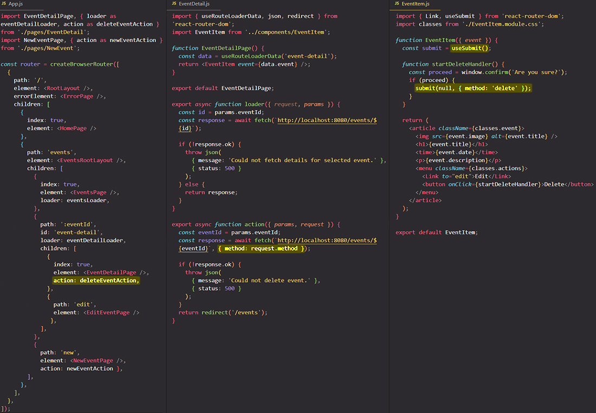

# Submitting data programmatically with `useSubmit` hook

==I wanna show you a different way of triggering an "action" function. The typical and default way is to use the `<Form>` component offered by React Router. The `<Form>` component will **automatically trigger the "action" function** of the currently active route, so the route for which the `<Form>` component was loaded==.

You could send the request to a different route by adding the `action` prop to the `<Form>` component and setting it to any other path, then in that case the "action" function of another path of another route definition object would be triggered.

```react
<Form method="post" action="/any-other-path"></Form>
```

So if you had an "action" function on some other route, you could point at that "action" function by simply setting the `<Form>` component `action` prop value to the path of the route for which you wanna trigger the "action" function, but if you wanna trigger the "action" function of the currently active route you don't need the `action` prop.

## Triggering an "action" function with `useSubmit` hook

The `<EventItem>` component has a button for deleting an event item. Since `<EventItem>` will be rendered as part of the `<EventDetailPage>` component, which is loaded for `<EventDetailPage>` route, we should add the "action" function to  the `<EventDetailPage>` route.



> **Note**: You could use instead of a button that trigger an event the `<Form>` component provided by `react-router-dom`. But if you use the `<Form>` component you can NOT add events that do something like window alerts or other things.

==Just as you can navigate programmatically, you can also **submit data and trigger an "action" function programmatically** with the special `useSubmit` hook imported from `react-router-dom`. The `useSubmit()` function is the imperative version of `<Form>` that let's you, the programmer, submit a form instead of the user==.

To the `useSubmit` function you can pass two arguments:

1. The first argument is the data that you wanna submit, and that data will automatically be wrapped in a `<Form>` data object, which you then could extract with the `.formData()` method;

2. The second argument allows you to basically set the same values you could set on a `<Form>` component, for example the `method` or the `action` if your "action" function would be defined on a different route path.

   ```react
   const submit = useSubmit();
   submit(data, {method: 'delete', action: '/a-different-path'});
   ```

That's how you can _submit data_ and _trigger an "action" function_ **programmatically**.

## References

1. [React - The Complete Guide (incl Hooks, React Router, Redux) - Maximilian Schwarzmüller](https://www.udemy.com/course/react-the-complete-guide-incl-redux/)
1. [`useSubmit` - reactrouter.com](https://reactrouter.com/en/main/hooks/use-submit)
