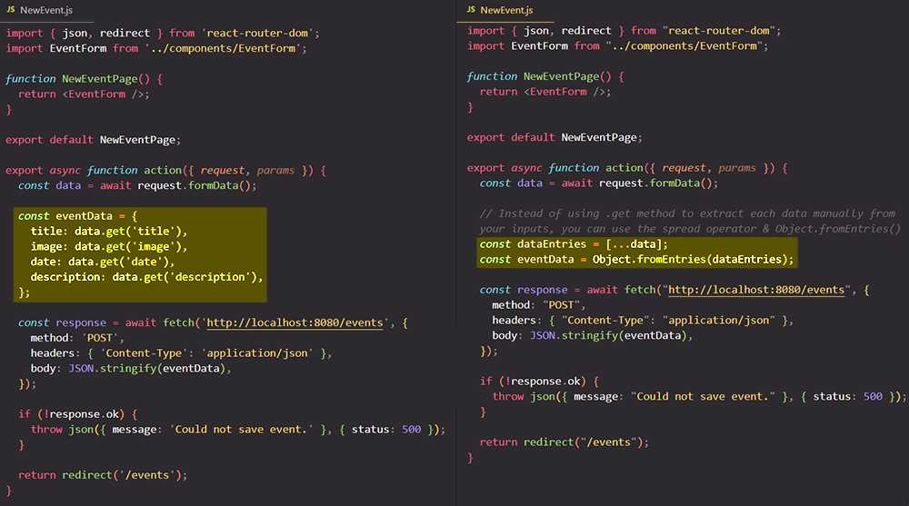

# Submitting `<form>`s and send data with "action" function and `<Form>` component

Just as you can add =="loader" functions to **load** data==, you can also add =="action" functions to **send** data==. Like the "loader" property, "action" property wants a function as a value. 

> **Note**: Just as with "loader" functions, you typically don't want to add your "action" functions in your route definitions file, but instead you want to keep that code close to the components to which them belongs.

Just like "loader" function, "action" functions:

- receives an object as parameter with `params` & `request` properties. Route params are parsed from [dynamic segments](https://reactrouter.com/en/main/route/route#dynamic-segments) and passed to your "action" function via `params`; this is useful for figuring out which resource to mutate. The`request` is a [Fetch Request](https://developer.mozilla.org/en-US/docs/Web/API/Request) instance being sent to your route; the most common use case is to parse the [FormData](https://developer.mozilla.org/en-US/docs/Web/API/FormData) from the request:

  ```react
  <Route
    action={async ({ request, params }) => {
      let formData = await request.formData();
      // ...
    }}
  />
  ```

- while you can return anything you want from an "action" function and get access to it from [`useActionData`](https://reactrouter.com/en/main/hooks/use-action-data), you can also return a web [Response](https://developer.mozilla.org/en-US/docs/Web/API/Response).

- you can `throw` in your "action" function to break out of the current call stack (stop running the current code) and React Router will start over down the "error path".

## Handling form submissions with React Router `<Form>` component

The great thing about React Router is that it makes handling form submissions a brace and it _helps with extracting data from that form_. For that, you should go to the component that holds the HTML `<form>` and make some changes to it:

### 1. The `name` attribute

==All your form `<input>` must have the [`name`](https://www.w3schools.com/tags/att_name.asp#:~:text=The%20name%20attribute%20specifies%20a,to%20target%20a%20form%20submission.) attribute, because those names will later be used for extracting the data==.

> **IMPORTANT**: Make sure your inputs have names or else the [`FormData`](https://developer.mozilla.org/en-US/docs/Web/API/FormData) will not include that field's value.

### 2. The `<Form>` component provided by React Router

==You need to replace the HTML `<form>` with the [`<Form>`](https://reactrouter.com/en/main/components/form) component== provided by `react-router-dom`. 

The `<Form>` component will make sure that the browser default of sending a request to the backend will be omitted but it will ==take that request that would've been sent and give it to your "action" function==, and that's pretty useful because that request will contain all the data that was submitted as part of the form.

> **IMPORTANT**: ==When the form is submitted, the `<Form>` component will **trigger the "action" function**==.

> **Note**: The Form component is a wrapper around a plain HTML [form](https://developer.mozilla.org/en-US/docs/Web/HTML/Element/form) that emulates the browser for client side routing and data mutations. It is *not* a form validation/state management library like you might be used to in the React ecosystem (for that, we recommend the browser's built in [HTML Form Validation](https://developer.mozilla.org/en-US/docs/Learn/Forms/Form_validation) and data validation on your backend server).

### 3. `<Form>` component: `method` & `action` attributes

#### The [`method`](https://reactrouter.com/en/main/components/form#method) attribute

You need to add to the `<Form>` component the `method` attribute and set this to "POST" for example, though the `<Form>` component also supports other HTTP methods like "GET" (default), "DELETE", "PATCH" or "PUT". Is important to understand that if you use the `<Form>` component the request will not be sent to the backend automatically, but instead to your "action" function and it will include all the form data.

> **Note**: The default method is "get". Get submissions *will not call an action*. Get submissions are the same as a normal navigation (user clicks a link) except the user gets to supply the search params that go to the URL from the form. All other methods are "mutation submissions", meaning you intend to change something about your data with POST, PUT, PATCH, or DELETE.

#### The [`action`](https://reactrouter.com/en/main/components/form#action) attribute

You _optionally_ add to the `<Form>` component the `action` attribute. ==The `action` attribute contains the url to which the form will be submitted==, just like [HTML form action](https://developer.mozilla.org/en-US/docs/Web/HTML/Element/form#attr-action). The only difference is the default action. With HTML forms, it defaults to the full URL. With `<Form>`, it defaults to the relative URL of the closest route in context; in other words, _it points to the matching segment of the URL for the route in which the `<Form>` is rendered_.

> **IMPORTANT**: When the user submits the form, React Router will match the `action` to the app's routes and call the `<Route action>` with the serialized `FormData`. When the action completes, all of the "loader" function data on the page will automatically revalidate to keep your UI in sync with your data.
>
> The method will be available on [`request.method`](https://developer.mozilla.org/en-US/docs/Web/API/Request/method) inside the route "action" function that is called.

You could send the request to a different route by adding the `action` prop to the `<Form>` component and setting it to any other path, then in that case the "action" function of another path of another route definition object would be triggered.

```react
<Form method="post" action="/any-other-path"></Form>
```

So if you had an "action" function on some other route, you could point at that "action" function by simply setting the `<Form>` component `action` prop value to the path of the route for which you wanna trigger the "action" function, but if you wanna trigger the "action" function of the currently active route you don't need the `action` prop.

## Extracting data from the `FormData`

To extract and use the data from your `<Form>` component in you "action" function, you need to use the `request` object with it [`.formData()`](https://developer.mozilla.org/en-US/docs/Web/API/Request/formData) method and then the `.get()` method.

> **Note**: Just as a "loader" function, the "action" function is executed by React Router and it receives an _object_ that includes a couple of helpful properties, to be precise the `request` and `params` properties. These properties are objects.

==The `.formData()` method return a Promise, so you need to use the `await` keyword==.

The `.get()` method is called to get access to the different input field values that were submitted. To `.get()` method you pass a string with the different identifiers of your input fields, so that would be the values you chose as names for the input fields.


## Redirect the user to another url with `redirect()`

Typically, when submitting a form what you want to happen is that you navigate the user away to a different page after successfully submitting the form. To do that, you can return in your "action" function the result of calling `redirect()`. `redirect()`, like `json()`, is a special function you can import from `react-router-dom` and like `json()`, ==`redirect()` creates a Response object==. However, it's a special Response object that simply redirects the user to a different page.

==For the `redirect()` function you just specify as parameter a path to which you wanna redirect the user and React Router will take care about the rest==.

## An alternative to `.get` method: the spread operator & `Object.fromEntries()`



## References

1. [React - The Complete Guide (incl Hooks, React Router, Redux) - Maximilian Schwarzmüller](https://www.udemy.com/course/react-the-complete-guide-incl-redux/)
1. [`action` - reactrouter.com](https://reactrouter.com/en/main/route/action)
1. [`<Form>` component - reactrouter.com](https://reactrouter.com/en/main/components/form)
1. [The `action` attribute for `<Form>` components](https://reactrouter.com/en/main/components/form#action)
1. [Working with `FormData` - reactrouter.com](https://reactrouter.com/en/main/guides/form-data)
1. [`Request.formData()` - MDN](https://developer.mozilla.org/en-US/docs/Web/API/Request/formData)
1. [`redirect` - reactrouter.com](https://reactrouter.com/en/main/fetch/redirect)
