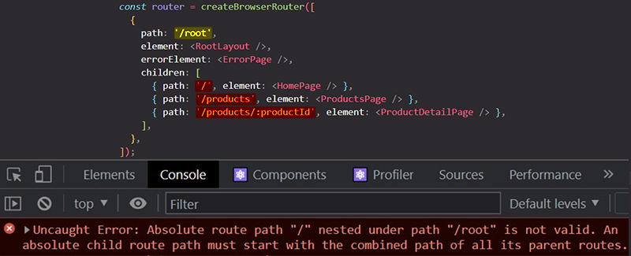

# Understanding absolute & relative paths

==When we _defining routes_, we _define the paths_ for which that routes should be active==.

In our example below, we got the root wrapper route, and then we got a couple of child routes inside of that route. ==All the paths defined in this example are **absolute paths** because they all start with **`/`**==. This simply means that they're always seen from _after_ the domain name.

> **Note**: ==If a path starts with `/`, it is an absolute path==.

```react
// Absolute paths start with /
const router = createBrowserRouter([
  {
    path: "/",
    element: <RootLayout />,
    errorElement: <ErrorPage />,
    children: [
      { path: "/", element: <HomePage /> },
      { path: "/products", element: <ProductsPage /> },
      { path: "/products/:productId", element: <ProductDetailPage /> },
    ],
  },
]);
```

If I change the wrapper path to `/root`, if I reload the browser URL page for `/products` I don't see anything on the browser, but neither if I do change the URL to `/root/products`. If I type in just `/root` I also don't see anything on the browser.

```react
// Wrong
const router = createBrowserRouter([
  {
    path: "/root",
    element: <RootLayout />,
    errorElement: <ErrorPage />,
    children: [
      { path: "/", element: <HomePage /> },
      { path: "/products", element: <ProductsPage /> },
      { path: "/products/:productId", element: <ProductDetailPage /> },
    ],
  },
]);
```

If a open the browser developer tools, I see an error:



==We have this error because we are **clashing route definitions**. We're saying that the parent route should handle all pages that start with `/root`, but then the child pages actually don't start with `/root`. To solve this error we can _remove the leading slashes on the child routes and that turns the child route definitions paths to relative paths_==:

```react
// All children routes are defined as relative paths because they don't start with /
const router = createBrowserRouter([
  {
    path: "/root",
    element: <RootLayout />,
    errorElement: <ErrorPage />,
    children: [
      { path: "", element: <HomePage /> },
      { path: "products", element: <ProductsPage /> },
      { path: "products/:productId", element: <ProductDetailPage /> },
    ],
  },
]);
```

==When defining child routes as relative paths, this means that the **child paths defined as relative paths are appended _after_ the path of the wrapper parent route path**. So if we have a child route with a relative path, then React Router will take a look at the path of the parent route and **append the child route path _after_ the parent route path**==.

==**Children relative paths are relative to the path defined in theirs parent route definition**==.

## Summary

```react
// Absolute paths start with /
const router = createBrowserRouter([
  {
    path: "/",
    element: <RootLayout />,
    errorElement: <ErrorPage />,
    children: [
      { path: "/", element: <HomePage /> },
      { path: "/products", element: <ProductsPage /> },
      { path: "/products/:productId", element: <ProductDetailPage /> },
    ],
  },
]);

// All children routes are defined like relative paths because they don't start with /
const router = createBrowserRouter([
  {
    path: "/",
    element: <RootLayout />,
    errorElement: <ErrorPage />,
    children: [
      { path: "", element: <HomePage /> },
      { path: "products", element: <ProductsPage /> },
      { path: "products/:productId", element: <ProductDetailPage /> },
    ],
  },
]);
```

## References

1. [React - The Complete Guide (incl Hooks, React Router, Redux) - Maximilian Schwarzmüller](https://www.udemy.com/course/react-the-complete-guide-incl-redux/)
