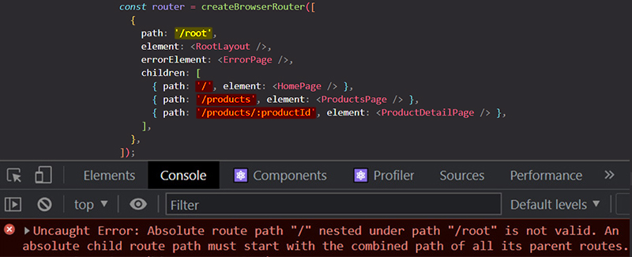
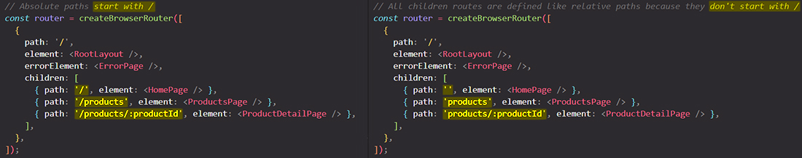

# Understanding absolute & relative routes paths

==When you _defining routes_, you _define the paths_ for which that routes should be active==.

In our example below, you got the root wrapper route, and then you got a couple of child routes inside of that route. ==All the paths defined in this example are **absolute route paths** because they all start with **`/`**==. This simply means that they're always seen from _after_ the domain name.

> **Note**: ==If a route path starts with `/`, it is an absolute route path==.

If you change the wrapper path to `/root`, if you reload the browser URL page for `/products` you don't see anything on the browser, but neither if you do change the URL to `/root/products`. If you type in just `/root` you also don't see anything on the browser. If a open the browser developer tools, you see an error:

==You have this error because you are **clashing route definitions**. You're saying that the parent route should handle all pages that start with `/root`, but then the child pages actually don't start with `/root`. To solve this error you can _remove the leading slashes on the child routes paths and that turns the child routes paths to relative paths_==:

> **Note**: All children routes are defined as relative paths because they don't start with `/`.

==When you are defining child routes as relative paths, this means that the **child paths defined as relative paths are appended _after_ the path of the wrapper parent route path**. So if you have a child route with a relative path, then React Router will take a look at the path of the parent route and **append the child route path _after_ the parent route path**==.

> **Important**: ==**Children relative paths are relative to the path defined in theirs parent route definition**==.

## Summary

## References

1. [React - The Complete Guide (incl Hooks, React Router, Redux) - Maximilian Schwarzmüller](https://www.udemy.com/course/react-the-complete-guide-incl-redux/)
