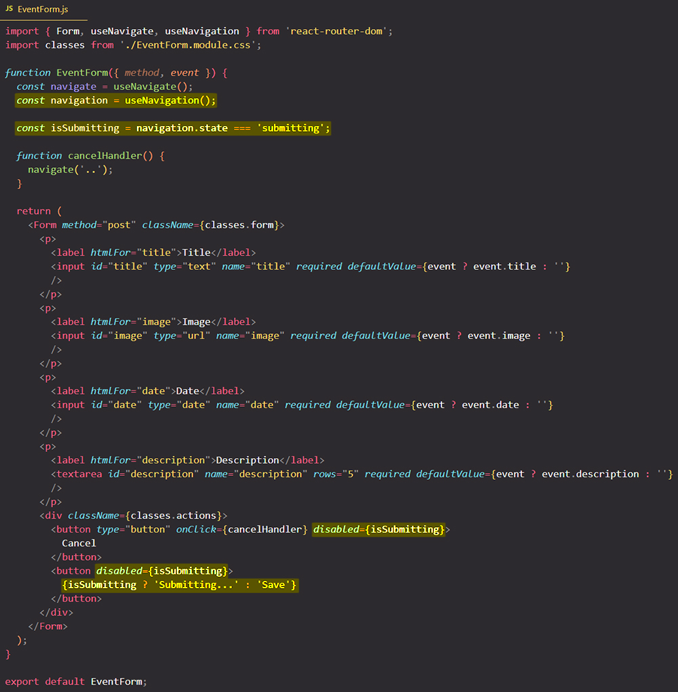

# Updating the UI state based on the submission status

You can use the `useNavigation` hook to ==update the UI based on different _navigation state_==.

The `useNavigation` hook gives you access to a navigation object (JavaScript object), and you can extract various pieces of information from that object, for example, all the data that was submitted; but you can also find out what ==the current state of the currently active transition is==.

==You can have a transition from one route to another if you click a link, but you can also have a transition if you submit a form==. Therefore, you also get information about the current data submission process and whether it completed already, so whether the "action" function that was triggered completed already.

> **Note**: If the current state is submitting (`navigation.state === 'submitting'`), I know that we are currently submitting data, so that the "action" function that was triggered is currently still active.

## References

1. [React - The Complete Guide (incl Hooks, React Router, Redux) - Maximilian Schwarzmüller](https://www.udemy.com/course/react-the-complete-guide-incl-redux/)