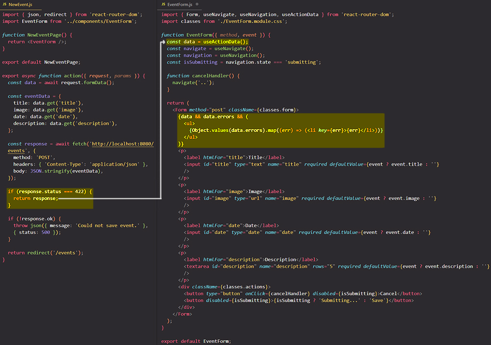

# Validating user input & outputting validation errors with `useActionData` hook

==`useActionData` hook does the same thing that `useLoaderData` hook==.

The `useActionData` hook provides the returned value from the previous navigation's `action` result, or `undefined` if there was no submission.

==The most common use-case for this hook is **form validation errors**==. If the form isn't right, you can return the errors and let the user try again:

==Like in "loader" function, the response that you return from your "action" function will be automatically parsed by the `useActionData` for you==.

## References

1. [React - The Complete Guide (incl Hooks, React Router, Redux) - Maximilian Schwarzmüller](https://www.udemy.com/course/react-the-complete-guide-incl-redux/)
1. [`useActionData` - reactrouter.com](https://reactrouter.com/en/main/hooks/use-action-data)