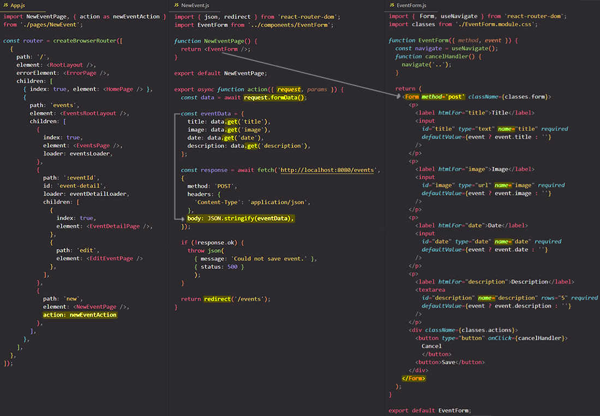

# Working with "action" function

Just as you can add =="loader" functions to _load_ data==, you can also add =="action" functions to _send_ data==. Like the "loader" property, "action" property wants an arrow function or a regular function. 

> **Note**: Just as with "loader" function, you typically don't want to add your "action" function in your route definitions file, but instead you want to keep that code close to the components to which it belongs.

The great thing about React Router is that it makes handling form submissions a brace and it helps with extracting data from that form. For that, you should go to the component that holds the form and make some changes to it:

- ==all your form inputs must have the `name` attribute==, because those names will later be used for extracting the data;
- ==you should replace the `<form>` element with the special `<Form>` component which is provided by `react-router-dom`==. Now the `<Form>` component will make sure that the browser default of sending a request to the backend will be omitted but it will take that request that would've been sent and give it to your "action" function, and that's pretty useful because that request will contain all the data that was submitted as part of the form. ==When the form is submitted, the `<Form>` component will **trigger the "action" function**==.
- ==you should add to the `<Form>` component the method property and set this to "post" for example==, though the `<Form>` component also supports other HTP methods like "delete", "patch" or "put", but the request and that's important, will not be sent to the backend automatically, but instead to your "action" function and it will include all the form data if you use the special `<Form>` component provided by `react-router-dom`.

To extract and use the data from your `<Form>` component in you "action" function you need to use the `request` object and its methods `.formData()` and `.get()`.

> **Note**: Just as a "loader" function, the "action" function is executed by React Router and it receives an object that includes a couple of helpful properties, to be precise the `request` and `params` properties.

The `.formData()` method return a Promise, so you need to use `await` keyword.

The `.get()` method is called to get access to the different input field values that were submitted. To `.get()` method you pass a string with the different identifiers of your input fields, so that would be the values you chose as names for the input fields.

Typically, when submitting a form what you want to happen is that you navigate the user away to a different page after successfully submitting the form. To do that, you can return in your "action" function the result of calling `redirect()`. `redirect()`, like `json()`, is a special function you can import from `react-router-dom` and like `json()`, ==`redirect()` creates a Response object==. However, it's a special Response object that simply redirects the user to a different page. ==For the `redirect()` function you just specify as parameter a path to which you wanna redirect the user and React Router will take care about the rest==.

## References

1. [React - The Complete Guide (incl Hooks, React Router, Redux) - Maximilian Schwarzmüller](https://www.udemy.com/course/react-the-complete-guide-incl-redux/)
