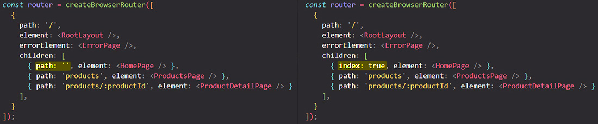

# Working with index routes

There is one special property you can add to some route definitions. This special property that would, for example, apply to the `<HomePage>` route definition in the example below:

What's special about this `<HomePage>` route definition? Well, in the end, it doesn't have a path. Instead, the `<HomePage>` should be ==loaded for the same path as you have on the parent route==. You have two different routes because you want to have the `<RootLayout>` as wrapping layout. ==It is quite common that you might have a wrapping layout route and then you have one child route that should be loaded for the parent's route path==. Now, you could solve it by adding no path like in example above, but alternatively you can add the special `index` property and set it to `true`.

==The `index` property turns the `<HomePage>` route into a so-called **index route**, which simply means it's the default route that should be displayed if the parent route's path is currently active.== So it will not be loaded for `products` or `products/productId`, but if you're on just `/` the `<HomePage>` index route will be activated.

With `{ index: true, element: <HomePage/> }` you get the same behavior as before when you have `{ path: '', element: <HomePage/> }`. ==You should be aware of this feature called index routes which allows you to define the default route that should be loaded if the parent routes path is active. **Index routes render in their parent route's [outlet](https://reactrouter.com/en/main/start/concepts#outlet) at the parent route's path**==.

## References

1. [React - The Complete Guide (incl Hooks, React Router, Redux) - Maximilian Schwarzmüller](https://www.udemy.com/course/react-the-complete-guide-incl-redux/)
1. [Index route - reactrouter.dom](https://reactrouter.com/en/main/route/route#index)
1. [Index routes - reactrouter.dom](https://reactrouter.com/en/main/start/concepts#index-routes)