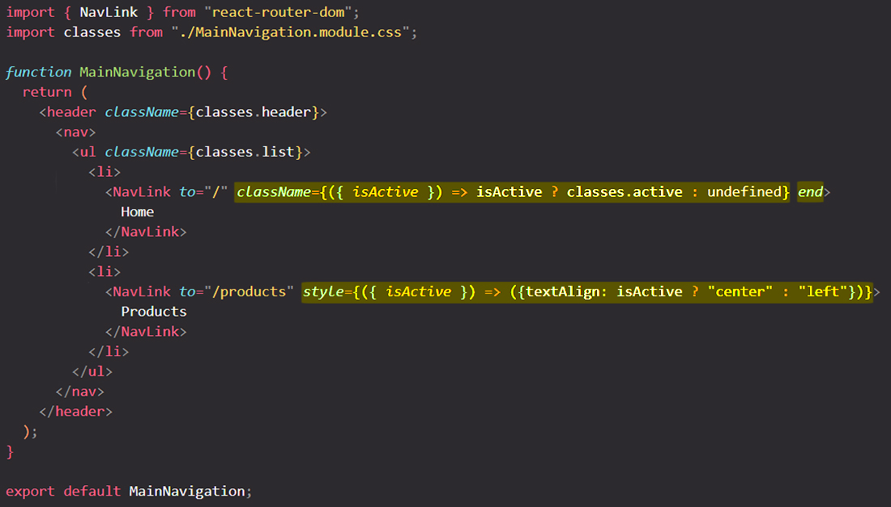

# Working with navigation links

Sometimes you might want to see which link is currently active when you're on a page. To support links that should show us whether they active or not, `react-router-dom` has an alternative to the [`<Link>`](https://reactrouter.com/en/main/components/link) component, and that is the `<NavLink/>` component.

==A `<NavLink>` is a special kind of `<Link>` that knows whether or not it is "active"==. This is useful when building a navigation menu such as a breadcrumb or a set of tabs where you'd like to show which of them is currently selected. It also provides useful context for assistive technology like screen readers.

==With `<NavLink>` you can **add classes or inline-styles _conditionally_**, based on whether a link is active or not==.

==By default, an `active` class is added to a `<NavLink>` component when it is active==.

`<NavLink>` is used just like `<Link>`, you can use it as a replacement for `<Link>`, but ==`<NavLink>` has one special behavior. If you add the `className` prop to it, it's actually not the regular `className` prop which takes a string (`className=""`), but instead it's a prop that takes a function, and that function should return the CSS class name that should be added to the `<a>` tag. Now that function also automatically receives an object from which we can destructure the `isActive` property==.

This object with the `isActive` property is provided by `react-router-dom`, and `isActive` has a boolean value, `true` if the link is currently active (if it led to the currently active route) or `false` (if it did not lead to the currently active route). So therefore ==we can use `isActive` to conditionally return CSS class name or inline-styles==.

==By default, the behavior of `<NavLink` is to treated a link as active when its **descendant paths are matched**==. You can use the `end` prop to ensure that a component isn't matched as "active" when its descendant paths are matched. `end` pros take as a value a boolean: `end={true}` or `end={false}`. You can also just add `end` with no value and this means that `end` is automatically set to `true`.

## References

1. [React - The Complete Guide (incl Hooks, React Router, Redux) - Maximilian Schwarzmüller](https://www.udemy.com/course/react-the-complete-guide-incl-redux/)
2. [`NavLink` - reactrouter.com](https://reactrouter.com/en/main/components/nav-link)