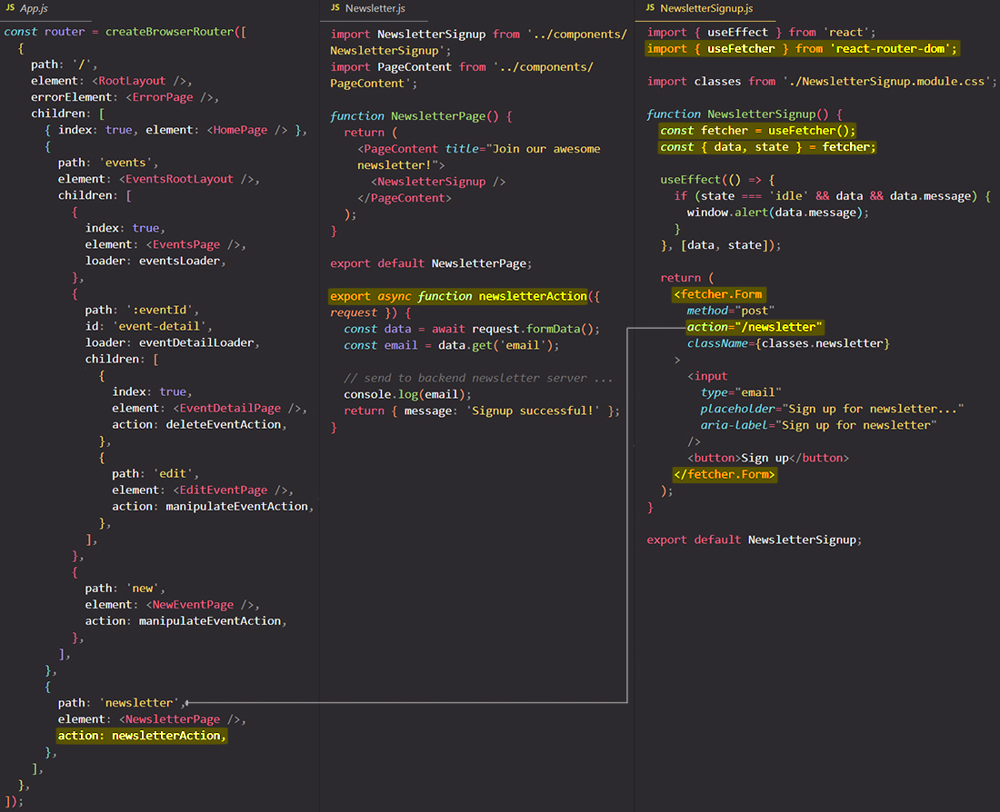

# Working with `useFetcher` hook

==In HTML/HTTP, data mutations and loads are **modeled with navigation**: `<a href>` and `<form action>`. Both cause a navigation in the browser==. The React Router equivalents are [`<Link>`](https://reactrouter.com/en/main/components/link) and [`<Form>`](https://reactrouter.com/en/main/components/form). But sometimes you want to ==call a [`loader`](https://reactrouter.com/en/main/route/loader) function _outside of navigation_==, or ==call an [`action`](https://reactrouter.com/en/main/route/action) function (and get the data on the page to revalidate) _without changing the URL_==.

==Many interactions with the server aren't navigation events. The `useFetcher` hook lets you plug your UI into your "action"/"loader" functions **without navigating**==. This is useful when you need to:

- _fetch data not associated with UI routes_ (popovers, dynamic forms, etc.)
- _submit data to "action" functions without navigating_ (shared components like a newsletter sign ups)
- handle multiple concurrent submissions in a list (typical "todo app" list where you can click multiple buttons and all should be pending at the same time)
- infinite scroll containers
- and more!

Fetchers have a lot of _built-in behavior_:

- Automatically handles cancellation on interruptions of the fetch
- When submitting with POST, PUT, PATCH, DELETE, the "action" function is called first
  - After the "action" function completes, the data on the page is revalidated to capture any mutations that may have happened, automatically keeping your UI in sync with your server state
- When multiple fetchers are inflight at once, it will
  - commit the freshest available data as they each land
  - ensure no stale loads override fresher data, no matter which order the responses return
- Handles uncaught errors by rendering the nearest `errorElement` (just like a normal navigation from `<Link>` or `<Form>`)
- Will redirect the app if your "action"/"loader" function being called returns a redirect (just like a normal navigation from `<Link>` or `<Form>`)

## `useFetcher()` returns an object

==The `useFetcher` hook, when executed, **returns an object** that includes a bunch of useful properties and methods==. For example, it gives you a `fetcher.Form` component which is different from the `<Form>` component you used before. It also gives you a `fetcher.submit` function which is different from the submit function you got from `useSubmit` hook, which you used before.

```react
import { useFetcher } from 'react-router-dom';

function Component() {
  const fetcher = useFetcher(); //useFetcher() returns an object that contains methods and properties
    
  fetcher.Form;		// different from <Form> component
  fetcher.submit;	// diffrent from const submit = useSubmit()
    
  return <h1>Component</h1>
};
```

## The difference between `fetcher.Form` and `<Form>` components

==But what is the difference between the `fetcher.Form` and `<Form>` component? If we use the `fetcher.Form` will actually _still trigger an "action" function_ but it will **not initialize a route transition**. So `fetcher.Form` should basically be used whenever you wanna trigger an "action" function, or also a "loader" function with help of the `fetcher.load` method, **without actually navigating to the page to which the "loader"/"action" function belongs**.==

> **Note**: `fetcher.Form` is just like `<Form>` except it _doesn't cause a navigation_.



### The `action` attribute

On the `fetcher.Form` you can add the `action` attribute and for example, point at `/newsletter` because you wanna trigger the "action" function off the `/newsletter` route, but you wanna make sure that you don't load the `newsletter` route's element component; you don't wanna load the `NewsletterPage` element that belongs to the `newsletter` route. ==With the default `<Form>` component you will trigger the `newsletter` route's "action" function BUT you also load the `NewsletterPage` element. With `fetcher.Form` you ONLY trigger the "action" function WITHOUT loading the element, because with `fetcher.Form` you don't transition, you don't move to a different route==.

==The `useFetcher` hook is the tool you should use if you wanna **interact with some "action"/"loader" function _without transitioning_**, so if you wanna send your requests behind the scenes without triggering any route changes==.

### `fetcher.data`

Because that's the goal of `useFetcher`, the object returned by `useFetcher` also includes a bunch of properties that help you understand whether your "action"/"loader" function that you triggered succeeded; you also get access to any data returned by that "action"/"loader" function with `fetcher.data`.

==The returned data from the "loader"/"action" function is stored in `fetcher.data`. Once the data is set, it persists on the fetcher even through reloads and resubmissions==.

### `fetcher.state`

You can also get hold of a `state` value which is equal to "idle", "loading" or "submitting", which you might know from the `useNavigation` hook, but `useNavigation` was meant to be used with actual route transitions, The `state` you get from `fetcher` object instead tells you whether the `useFetcher` behind the scenes completed its "loader"/"action" function that was triggered.

==You can know the state of the fetcher with `fetcher.state`. It will be one of==:

- ==**idle**== - nothing is being fetched.
- ==**submitting**== - A route action is being called due to a fetcher submission using POST, PUT, PATCH, or DELETE
- ==**loading**== - The fetcher is calling a loader (from a `fetcher.load`) or is being revalidated after a separate submission or `useRevalidator` call

### `fetcher.load()`

==Loads data from a route "loader" function==. Although a URL might match multiple nested routes, a `fetcher.load()` call will only call the loader on the leaf match (or parent of [index routes](https://reactrouter.com/en/main/guides/index-search-param)).

If you find yourself calling this function inside of click handlers, you can probably simplify your code by using `<fetcher.Form>` instead.

### `fetcher.submit()`

==The imperative version of `<fetcher.Form>`==. If a user interaction should initiate the fetch, you should use `<fetcher.Form>`. But if you, the programmer are initiating the fetch (not in response to a user clicking a button, etc.), then use this function.

### `fetcher.formData`

When using `<fetcher.Form>` or `fetcher.submit()`, the form data is available to build optimistic UI.

### `fetcher.formAction`

Tells you the action url the form is being submitted to.

```react
<fetcher.Form action="/mark-as-read" />;

// when the form is submitting
fetcher.formAction; // "mark-as-read"
```

### `fetcher.formMethod`

Tells you the method of the form being submitted: get, post, put, patch, or delete.

```react
<fetcher.Form method="post" />;

// when the form is submitting
fetcher.formMethod; // "post"
```

## Summary

==`useFetcher` is the tool you should use if you wanna trigger a "loader"/"action" function without actually loading the route's element to which that "loader"/"action" function belongs==.

## References

1. [React - The Complete Guide (incl Hooks, React Router, Redux) - Maximilian Schwarzmüller](https://www.udemy.com/course/react-the-complete-guide-incl-redux/)
2. [`useFetcher` - reactrouter.com](https://reactrouter.com/en/main/hooks/use-fetcher)