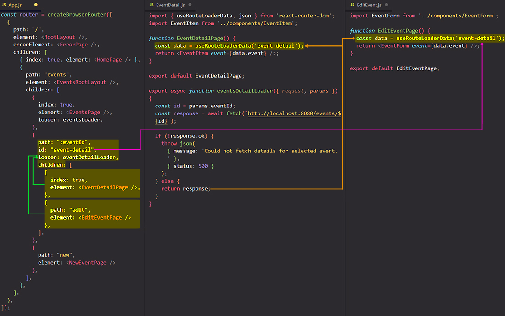

# `useRouteLoaderData` hook & accessing data from other Routes

In the `<EditEventPage>` component we need the **same data** that we fetched in the `<EventDetailPage` component. These are two different route definitions (sibling routes), and therefore the same "loader" function would be needed for each route. `<EditEventPage>` route couldn't access the "loader" function of `<EventDetailPage>` route because they are siblings routes. Only a child route could access the data returned by a "loader" function that is defined in the parent route.

## Fetch the same data for different children routes by adding a parent route with a "loader" function

Instead of defining the same "loader" function twice for each sibling route, you can add a route parent that does not render an element. Now in the parent route I don't need an element because I don't want to have any shared layout or anything like that. Instead, I'm using this approach because I want to add a "loader" function to the parent route so the child routes can have access to the returned data of that "loader" function. This is also how you can use nested routes to construct a URL, with the parent route URL and the child routes URLs.

==**You can also use the nested routes feature not just to use a wrapper layout component, but also to use a shared "loader" function**. Because as you learned, you can access "loader" function data in any component that's on the same level or a lower level than the route where the "loader" function is added==.

To access the data returned by the "loader" function, instead of using `useLoaderData` you need to use a different hook which is called `useRouteLoaderData`. This hook works almost like `useLoaderData` but it takes a route ID as an argument (the ID you assign to the parent route).

==So with the `useRouteLoaderData` you can get access to  the data of a higher level "loader" function from a route that doesn't have a "loader" function. Now you can reuse the same "loader" function across **multiple routes which all need the same data**==.

## References

1. [React - The Complete Guide (incl Hooks, React Router, Redux) - Maximilian Schwarzmüller](https://www.udemy.com/course/react-the-complete-guide-incl-redux/)