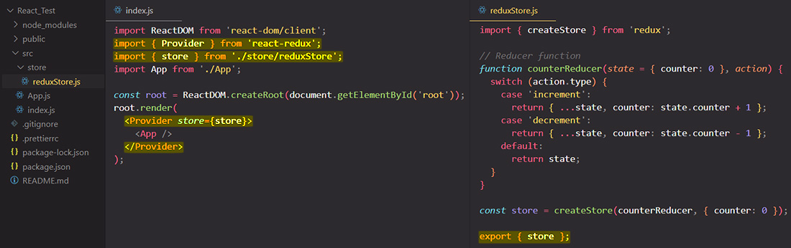

# Creating a Redux store for React with `.createStore()`

>**IMPORTANT**: ==Redux `createStore()` is (not) deprecated==. In the next lectures, you'll learn about Redux and how to use it. As part of these lectures a so-called Redux store will be created with help of a function called `createStore()`.
>
>==When using that function in your code, you might get a **deprecation warning** by your IDE or when running the app. **You should ignore this warning!** You can still use `createStore()` without issues.==
>
>Indeed, the React Redux team now recommends the usage of an extra package called ==**Redux Toolkit**== and another way of creating the Redux store. That package will **indeed be covered a little bit later in this section** as well. But by first diving into `createStore()` and the next lectures, you'll learn **how Redux works and what it does**. This is some crucial knowledge that's required no matter if you're then using Redux Toolkit (as mentioned: Covered later as well) or not!

## How to install the Redux package with NPM?

You install the Redux library by typing into your VSCode terminal the `npm install redux react-redux` command.

To use the Redux library you need to import it into your `.js` file with:

- `import { someFeature } from 'redux'` or
- `import { someFeature } from 'react-redux'`

> **NOTE**: ==Through 'react-redux' package, Redux and React applications can communicate to each other.==

## Steps to set up a functionally Redux store

If you remember the slide in the "How Redux works?", we will need to:

1. Create a ==**Redux store**== with **`.createStore()` function**, imported from 'redux' library;
2. Create a ==**reducer function**== which will manipulate the Redux store;
3. Create a React component that ==**sets up a subscription**== to the Redux store, with the help of **`useSelector` hook**, imported from 'react-redux' library;
4. Create an ==**action**== that trigger state changes, with the help of **`useDispatch` hook**, imported from 'react-redux' library.

## 1. Create a **Redux store** with `.createStore()` function

The `createStore()` is a function exposed by the 'redux' library, which does what the name implies, it ==creates a Redux store that **holds the complete state tree** of your app==. There should ==only be **a single store** in your app==.

```react
import { createStore } from 'redux';

const store = createStore(); // createStore() creates a Redux store that holds the complete state tree of your app. There should only be a single store in your app.
```

`createStore()` ==**returns an object**== that holds the complete state of your app. The only way to change its state is by [dispatching actions](https://redux.js.org/api/store#dispatchaction). You may also [subscribe](https://redux.js.org/api/store#subscribelistener) to the changes to its state to update the UI.

## 2. Create a Reducer Function

The Redux store should manage some data, and the data which it manages is in the end determined by the reducer function, because ==it's the reducer function which will produce new state snapshots.== ==The reducer has to go of spitting out a new state snapshot whenever an action reaches it==. So therefore the next thing we need to add after we create a Redux store is a reducer function, that will be passed as an argument to `createStore` function:

```react
import { createStore } from 'redux';

// Reducer Function
function counterReducer(state = { counter: 0 }, action) {
  switch (action.type) {
    case 'increment':
      return {...state, counter: state.counter + 1};
    case 'decrement':
      return {...state, counter: state.counter - 1};
    default:
      return state;
  }
}

// We passed the "counterReducer" reducer function to createStore() because the Redux store needs to know which reducer is responsible for changing that Redux store
const store = createStore(counterReducer);
```

> **NOTE**: When we run the code above _for the first time_, the reducer function will be executed with an **initial state** and a **default action** that should spit out the initial state.

==The reducer function is passed as the first argument to the `createStore()` function== because the Redux store needs to know which reducer is responsible for changing its data. Keep in mind, it's the reducer function that works together with the Redux store, so the Redux store wants to know who the reducer function is that will manipulate the Redux data.

==A reducer function is **a standard JavaScript function**, but it will be called by Redux.==

==The reducer function will always receive **two arguments**, the existing (old) _state_ and the _action_ that was dispatched. The reducer function must always return a certain output, it **must always return a new state object** which will replace the existing (old) state==.

==The output of Reducer Function typically will be a state _object_ (which can have any structure we want),== because in most applications state is more than just one single value, but theoretically, it can be any kind of value type (number, string, boolean etc).

> **NOTE**: A reducer function should be a pure function:
>
> - the same inputs always should produce exactly the same output;
> - there should be no side effects inside of reducer function. You must not send a HTTP request or write something to local storage or fetch something from local storage.

## 3. Create a React component that **sets up a subscription** to Redux store

### Provide the Redux store to a React component with the help of `<Provider/>` component

Now we just need to make Redux aware of the `<CounterComponent/>` and tell it that the `<CounterComponent/>` should be executed whenever our Redux state changes, and we do that by importing from the 'react-redux' library the `<Provider/>` component:

```react
import { store } from './store/reduxStore.js'
import { Provider } from 'react-redux'

function CounterComponent() {
  return ...
}

export default function App() {
   return (
      <Provider store={store}>
      	<CounterComponent/>
      </Provider>
   )
}
```

==The `<Provider>` component makes the Redux store available to any nested components that need to access the Redux data.== Since any React component in a React Redux app can be connected to the store, most applications will render a `<Provider>` at the top level, with the entire app’s component tree inside of it.

> **NOTE**: To provide our Redux store to the React app, we typically go into the `index.js` file, where we rendered the entire app, so to the highest level we can go in our React application, to the top of our component tree.
>
> 

### Get access to the Redux store and subscribe a React component to it with the help of `useSelector` hook

To get access to our Redux store and to the data in there, we need to import from 'react-redux' library a custom React Hook made by the React Redux team, that is called `useSelector` hook.

> **Note**: There also is a `useStore` hook, which we could use as well, which gives us direct access to the Redux store, but ==`useSelector` is a bit more convenient to use, because that allows us to then automatically **select a part of our state managed by the Redux store**==.

==`useSelector` need a function as an argument==, a function which will be executed by Redux, ==a function which determines which piece of data we wanna extract from our Redux store==.

> **NOTE**: At this moment we have a very simple state, a single JavaScript object that contains only the `counter` property, but in bigger applications you will have more complex states with tons of different properties, maybe nested objects and arrays, and therefore being able to just get just a tiny part of that overall state object in a easy way is worth a lot.

The function passed as argument to `useSelector` we'll receive the state managed by Redux, and then we return the part of the state which you wanna extract:

```react
// import { useStore } from 'react-redux'
import { useSelector } from 'react-redux'

function CounterComponent() {
  const counter = useSelector(state => state.counter);
    
  return ...
}
```

The great thing is that when we use `useSelector`, ==React Redux will **automatically set up a subscription to the Redux store for the component in which you use `useSelector` hook**. So your React component will be updated and will receive the latest data  automatically, whenever that data changes in the Redux store (in our case the `counter`).==

So ==by using the `useSelector` hook, the `<CounterComponent/>` is automatically reactive and changes to the Redux store will cause the `<CounterComponent/>` to be re-executed==, so you always have the latest `counter`. That's why `useSelector` is a very useful hook, and why it is the hook we use for getting data out of the Redux store.

If you ever would unmount the `<CounterComponent/>`, if it would be removed from the DOM for whatever reason, React Redux would also automatically clear the subscription for you. So ==with `useSelector` hook React Redux manages the component subscription for you behind the scenes==.

## 4. Create an **action** that trigger state changes with the help of `useDispatch` hook

Now we got our Redux store, our reducer function, we subscribe the React component to Redux store, and we can read data from the Redux store. Now we also need an _action that can be dispatched_, and _trigger the reducer function to modify the data_ in the Redux store.

For dispatching actions from React components, we need to import from 'react-redux' library the `useDispatch` hook. This hook returns a reference to the `dispatch` function from the Redux store. You may use it to dispatch actions as needed.

==To the `dispatch` function you will pass:==

- ==a JavaScript object (called an **action object**)== that have a `type` property that uniquely identify the `dispatch` function;
- or ==an **action creator**==. An action creator is _a JavaScript function that creates an action object_. In Redux, action creators simply return an action object and pass the argument value if necessary. Action creator functions promotes writing _clean code_ and helps to achieve _reusability_.

```react
// Dispatching by passing an action object
const actionObject = { type: 'ADD', payload: 'value' };
dispatch(actionObject);

// Build an action creator & dispatching by passing an action creator 
function add(value) {
   return { type: 'ADD', payload: value };
}
dispatch(add('value'));
```


```react
import { useSelector, useDispatch } from 'react-redux'

export default function CounterComponent() {
  const counter = useSelector(state => state.counter);
  const dispatch = useDispatch();

  function handleIncrementClick() {
    dispatch({
      type: 'increment', // unique identifier
    });
  }
  
  function handleDecrementClick() {
    dispatch({
      type: 'decrement', // unique identifier
    });
  }

  return (
    <>
      <button onClick={handleIncrementClick}>Increment: {counter}</button>
      <button onClick={handleDecrementClick}>Decrement: {counter}</button>
    </>
  )
}
```


## Final code snippet


## References

1. [React - The Complete Guide (incl Hooks, React Router, Redux) - Maximilian Schwarzmüller](https://www.udemy.com/course/react-the-complete-guide-incl-redux/)
1. [`.createStore()` - redux.js.org](https://redux.js.org/api/createstore)
1. [`<Provider>` component - redux.js.org](https://react-redux.js.org/api/provider)
1. [`useSelector` hook - redux.js.org](https://react-redux.js.org/api/hooks#useselector)
1. [`useStore` hook - redux.js.org](https://react-redux.js.org/api/hooks#usestore)
1. [`useDispatch` hook - redux.js.org](https://react-redux.js.org/api/hooks#usedispatch)