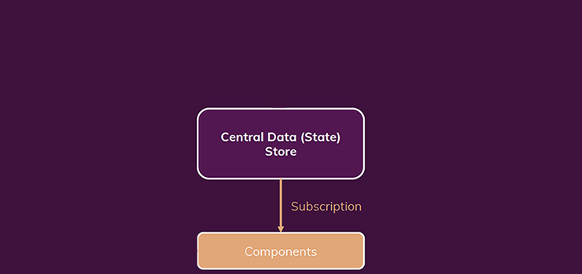

# How Redux works?

## Central Data (State) Store

==Redux is all about having one **Central Data (State) Store** in your application==, and with data I mean state. And that is super important. ==You have exactly **one store**, you never have more than one store==. It's one store for all your state for your entire application.

In this store, you would store authentication state, theming, maybe some user input state you wanna save, whatever it is. Whichever cross component or app wide state you have, it goes into this one store.

Now this might sound unmaintainable, but ==the good thing is that we don't directly need to manage the entire store all the time==.

So we have this Central Data (State) Store. What do we do with it? Ultimately, we have data in that store, so that we can use it from inside our components, because if some data there changes, we wanna know about that in a component, so that we can react accordingly and update the UI. For this components ==**set up subscriptions** to our Central Store==.

## Components subscribe to Central Data (State) Store

**Components subscribe to the Central Store**, and whenever the data changes, the store notifies components, and then components can get the data they need, for example the current authentication status, so they **get a slice of the Redux store**, and they can then use it.

So that's how we **get data out of the store**. But of course, since this data is state, so data which also changes from time to time, we need a way of changing that data (state). So how do we change data into store then?

## Reducer Function

Here's one very important rule: ==components **never** directly manipulate the store data==. So we have that subscription, but we don't have a data flow in the other direction. Components don't directly manipulate that data in the store. Instead for that, we use a concept called reducers. We have a reducer function. This reducer function which we have to set up is responsible for mutating, so for changing the store data.

> **Note**: The term reducer is of course something we have heard before, with `useReducer` in React, but the reducer function in Redux is not that `useReducer` hook we learned about. Reducer functions in general, are just a general concept.

Reducer functions are functions which takes some input and then transform that input, they reduce it. Reducer functions in general transform inputs and spit out a new output a new result. So ==Reducer Function is a general programming concept==, which `useReducer` hook uses and which the Redux reducer function will also uses.

So we have a reducer function which is responsible for updating the store data, snd we have components that subscribe to that data. How do we now connect components and that reducer function? Because ultimately it will be the components that should trigger a data change.

## Dispatching actions from components

Trigger is a good word for that because we have a third concept. We have actions and components dispatch actions. Therefore we could also say that ==components trigger certain actions==.

==**An action is really just a simple JavaScript object** which describes the kind of operation the reducers should perform==. Therefore, Redux then forwards actions to the Reducer Function, reads that description of the desired operation, and then this operation is performed by the reducer.

## Summary

So components dispatch actions which describe what should be done, but don't do it directly, then these actions are forwarded to the reducer, the reducer then does what the action wants, and then the reducer spits out a new state, which effectively will replace the existing state in that Central Data Store. And when that happens, when that state in that data store is updated, subscribing components are notified, so that they can update their UI.

## References

1. [React - The Complete Guide (incl Hooks, React Router, Redux) - Maximilian Schwarzmüller](https://www.udemy.com/course/react-the-complete-guide-incl-redux/)