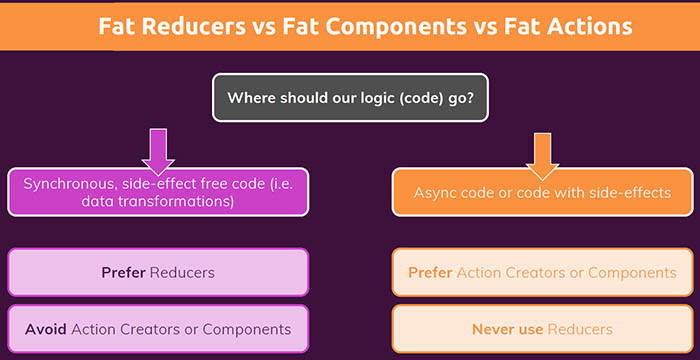
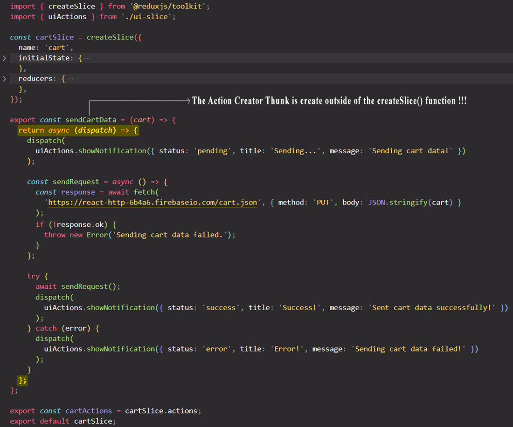
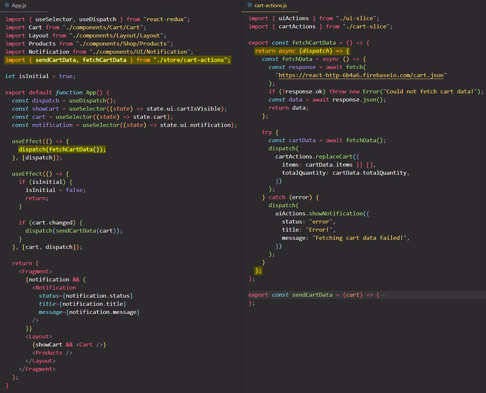

# Redux & side effects (and asynchronous code): Redux Thunks Middleware
## Where should our logic (code) go?

## Where to write our side effects?

==Your reducer functions must be **pure functions**, **side-effect free**, and **synchronous**.== A pure function for the same input it will always produce the same output, without any side effects that happen along the way, without any asynchronous code that blocks it. No code of that kind must be part of your reducer functions.

When working with Redux, when we dispatch some action that would involve a side effect (like a HTTP request that should be sent), the question is where should we then put that side effect code? Where should we put our asynchronous code when working with Redux? Because the reducer functions is clearly the wrong place as we just learned.

The answer to this question is that we have two possible places where we can put our side effects:

- ==we can **put our side effects directly into React component inside `useEffect`** hook, and then we only dispatch an action once that side effect is done==, so Redux doesn't know anything about that side effect;
- ==we write our own **action creator function** (also called **Action Creator Thunk**) that have inside of them side effects==, so we don't use the automatically generated ones Redux Toolkit gives us, but instead we write our own action creators. It turns out that for those action creators Redux actually has a solution that allows us to perform side effects and run asynchronous tasks as part of this action creators, without changing the reducer function because that reducer function must stay side effect free.

## An introduction to Thunks Middleware

We can't make a HTTP request inside a reducer function, because reducer functions need to be pure functions with no side effects. So ==by itself, **a Redux store doesn't know anything about performing asynchronous logic**, like a HTTP request. A Redux store only knows how to **synchronously dispatch actions** and update the state.== Therefore, ==any asynchronous operations like a HTTP request need to happen **outside of a reducer function**==.

As you read above, one solution is to fetch the data within a React component, and then dispatch an action to the Redux store with that received data. This is possible, but it's not an ideal solution, and the reason for that is that ==we usually want to **keep our React components clean and free of data fetching**, and we also want our important data **fetching logic encapsulated somewhere, so all in one place**, and not have it spread all over the application==. Therefore, fetching data inside React components is not ideal.

But if not in the Redux store and not in the React components, then where do we perform asynchronous actions? Well, that's where Middleware function comes into play. In Redux, ==Middleware is basically a function that sits between the dispatching and the Redux store. This means that a Middleware function allows developers to run some code after dispatching an action, but before that action reaches the reducer in the Redux store.==

==Usually after we dispatch, the action immediately reaches the reducer and the state is updated. But with a Middleware function, we can do something with the action _before_ that action actually gets into the reducer. Therefore, **a Middleware function is the perfect place for side effects** like an API call (HTTP request), setting timers, logging to the console, or even pausing and canceling the action altogether.==

Now that we know what Middleware function is, where does Middleware actually come from? Well, ==we can write Middleware functions ourselves, but usually, we just use some third party package==. And in the case of asynchronous operations, the most popular Middleware in Redux is called Redux Thunk.

## Thunks Middleware in Redux Toolkit: Action Creator Thunk 

==**Redux Toolkit make automatic setup of Redux Thunk Middleware functions.**==

A thunk is simply a function that delays an action until later, until something else finished. We could write an action creator as a thunk, which does not immediately return the action object, but which instead returns another function which eventually returns the action. So that we can run some other code before we then dispatch the actual action object that we did want to create.

We write our Action Creator Thunks in the `.js` file where we manage the Redux state.

==**The Action Creator Thunk will not return an action object like you use to do with regular Action Creator, but it will return a function that will receive an `dispatch` argument.** The returned function must dispatch (that's the reason you passed to it the `dispatch` argument) the action object at the end of the HTTP request with the data retrieved from the API call.== So with Action Creator Thunk we delay the creation of the action object to the future, after the HTTP request has successfully retrieved the data.

> Note: The returned function can dispatch actions before the HTTP request, but if you dispatch actions after the HTTP request, the Action Creator Thunk will dispatch that action only when the HTTP request is finished.

Redux will automatically call this returned function for you, when you will dispatch in your React component.

> Note: Keep in mind that when we are using Action Creator Thunks, instead of returning an action object like we use to do with Action Creator Function, we return a new function.

### A first example

I `dispatch(sentCartData(cart))` and I'll execute the `sendCartData` function, and pass `cart` as an argument to it. Now this might look weird.

What we dispatched before always were action creators, so functions that return an action object with a `type` property and so on. Now in first image above, we are instead dispatching a function that returns another function. But the great thing when using Redux Toolkit, it is prepared for that. ==It doesn't only accept simple action objects with a `type` property; instead it also accept action creators that return functions. If Redux Toolkit sees that you're dispatching an action which is actually a function, instead of action object, Redux Toolkit will execute that function for you.== And with that function, it will give us the `dispatch` argument automatically. So that in that executed function we can dispatch again, because there's a such a common pattern that we wanna have action creators that can perform side effects, and that can then dispatch other actions, which eventually reached the reducers as part of a flow off side-effects, or as a flow of steps that should be taken.

Why would we wanna use this pattern? Well, it's simply ==an alternative to having this logic in your React component==. You can add this logic in your React components, but it's also not a bad idea to keep your React components lean, to not have too much logic in them. The `App` component is now leaner, it only dispatches one action, not multiple actions, and it doesn't care about sending the HTTP request, and all the hard work happens inside of our custom Action Creator function, in our Redux files.

## Another example

## References

1. [React - The Complete Guide (incl Hooks, React Router, Redux) - Maximilian Schwarzmüller](https://www.udemy.com/course/react-the-complete-guide-incl-redux/)
1. [Writing Logic with Thunks - redux.js.org](https://redux.js.org/usage/writing-logic-thunks)