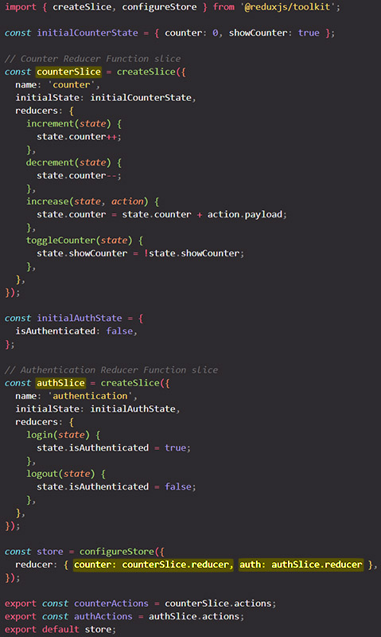
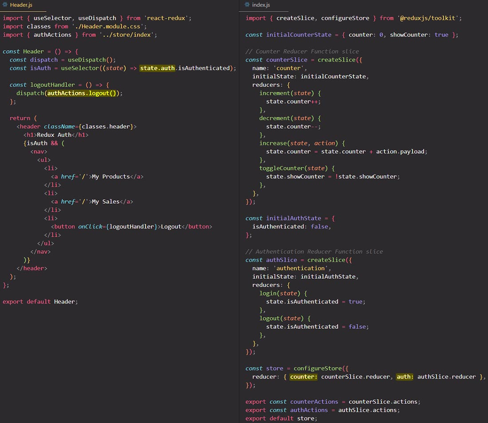

# Redux Toolkit: Working with multiple slices

## Reading & dispatching from a new slice

## References

1. [React - The Complete Guide (incl Hooks, React Router, Redux) - Maximilian Schwarzmüller](https://www.udemy.com/course/react-the-complete-guide-incl-redux/)