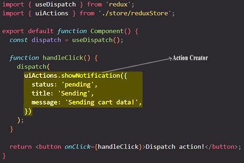

# Using an Action Creator Thunk

We can't make an HTTP request inside a reducer because reducers need to be pure functions with no side effects. So by itself, a Redux store doesn't know anything about performing asynchronous logic like HTTP request. A Redux store only knows how to synchronously dispatch actions and update the state. Therefore, **any asynchronous operations like an HTTP request need to happen _outside a reducer_**.

We could we maybe fetch the data inside the React component and then dispatch an action to the Redux store with that received data? Well, that is actually possible, but it's not an ideal solution, and the reason for that is that we usually want to keep our React components clean and free of data fetching, and we also want our important data fetching logic encapsulated somewhere, so all in one place and not have it spread all over the application. Therefore, fetching data inside React components is not ideal.

But if not in the Redux store and not in the React components, then where do we perform asynchronous actions? Well, that's where Middleware function comes into action. In Redux, Middleware is basically a function that sits between the dispatching and the Redux store. This means that a Middleware function allows developers to run some code after dispatching an action, but before that action reaches the reducer in the Redux store.

Usually after we dispatch, the action immediately reaches the reducer and the state is updated. But with a Middleware function, we can do something with the action before that action actually gets into the reducer. Therefore, a Middleware function is the perfect place for our asynchronous API call (HTTP request), as well as other operations, such as setting timers, logging to the console, or even pausing and canceling the action altogether. So in essence, Middleware functions are the place for side effects in the Redux cycle.

Now that we know what Middleware function is, where does Middleware actually come from? Well, we can write Middleware functions ourselves, but usually, we just use some third party package. And in the case of asynchronous operations, the most popular Middleware in Redux is called Redux Thunk.


Redux Toolkit make automatic setup of Redux Thunk Middleware functions.

Up until now, we are using simples action creator. We get those action creators automatically by Redux Toolkit, and when we call them, Redux Toolkit automatically create the action objects which we dispatch.



> **Note**: ==Action creators are **the functions that encapsulate the process of creation of an _action object_**.== These functions simply return a plain JavaScript object which is an action. It promotes writing _clean code_ and helps to achieve _reusability_.
>
> ```react
> // Build an action creator
> function add(value) {
>     return { type: 'add', payload: value };
> }
> ```
>
> ```react
> // Dispatching by passing an action object
> dispatch({ type: 'add', payload: 50 })
> 
> // Dispatching by passing an action creator
> dispatch(add(50)) 
> ```

We can also write our **own action creators** and we can write them to create so-called thunks. Now what is a thunk?

A thunk is simply a function that delays an action until later, until something else finished. We could write an action creator as a thunk, which does not immediately return the action object, but which instead returns another function which eventually returns the action. So that we can run some other code before we then dispatch the actual action object that we did want to create.

## How to build an Action Creator Thunk

We write our Actions Creator Thunks in the `.js` file where we manage the Redux state.


The Action Creator Thunk will not return an action object like you use to do with regular Action Creator, but it will return a function. The returned function must dispatch (that's the reason you passed to it the `dispatch` argument) the action object at the end of the HTTP request with the data retrieved from the API call. So with Action Creator Thunk we delay the creation of the action object to the future, after the HTTP request has successfully retrieved the data.

> Note: The returned function can dispatch actions before the HTTP request, but if you dispatch actions after the HTTP request, the Action Creator Thunk will dispatch that action only when the HTTP request is finished.

Redux will automatically call this returned function for you, when you will dispatch in your React component.

> Note: Keep in mind that when we are using Action Creator Thunks, instead of returning an action object like we use to do with Action Creator Function, we return a new function.


I `dispatch(sentCartData(cart))` and I'll execute the `sendCartData` function, and pass `cart` as an argument to it. Now this might look weird.

What we dispatched before always were action creators, so functions that return an action object with a `type` property and so on. Now in first image above, we are instead dispatching a function that returns another function. But the great thing when using Redux Toolkit, it is prepared for that. ==It doesn't only accept simple action objects with a `type` property; instead it also accept action creators that return functions. If Redux Toolkit sees that you're dispatching an action which is actually a function, instead of action object, Redux Toolkit will execute that function for you.== And with that function, it will give us the `dispatch` argument automatically. So that in that executed function we can dispatch again, because there's a such a common pattern that we wanna have action creators that can perform side effects, and that can then dispatch other actions, which eventually reached the reducers as part of a flow off side-effects, or as a flow of steps that should be taken.

Why would we wanna use this pattern? Well, it's simply ==an alternative to having this logic in your React component==. You can add this logic in your React components, but it's also not a bad idea to keep your React components lean, to not have too much logic in them. The `App` component is now leaner, it only dispatches one action, not multiple actions, and it doesn't care about sending the HTTP request, and all the hard work happens inside of our custom Action Creator function, in our Redux files.

## Another example


## References

1. [React - The Complete Guide (incl Hooks, React Router, Redux) - Maximilian Schwarzmüller](https://www.udemy.com/course/react-the-complete-guide-incl-redux/)