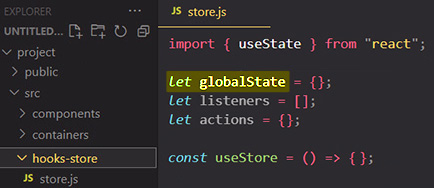
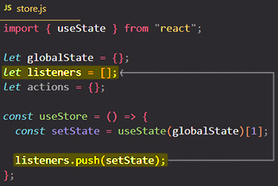
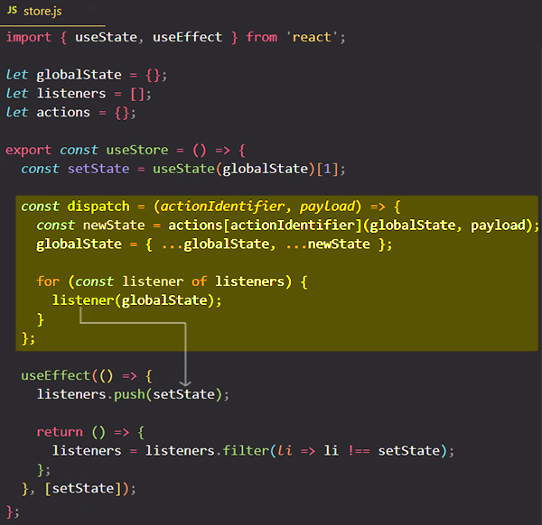
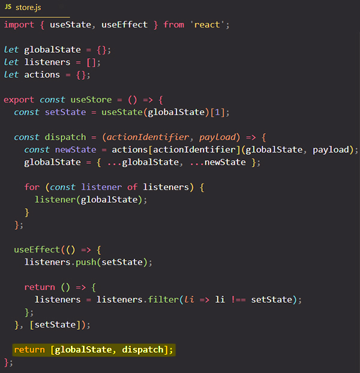
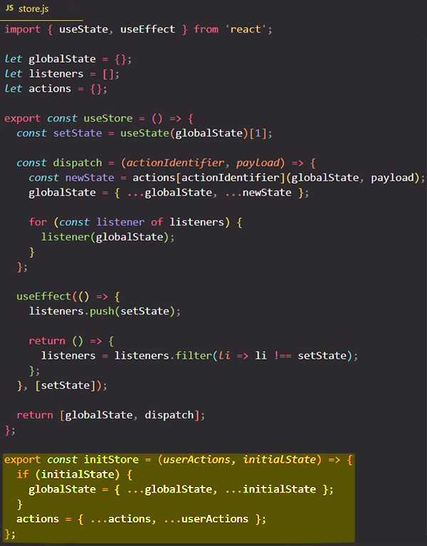

# Alternative 2: Using a custom Hook - create an abstract store hook that manage the wide-state data

## Understanding the global state: `globalState` variable

I want to have some state in my custom hook and that state will actually be state that is stored in `globalState` variable. Is important to notice that ==`globalState` is **defined outside of my custom hook, so it's global**. It's not recreated when we call `useStore` custom hook, it's not created separately for every component that consumes the custom hook. Instead it will be created once when the "store" file is first imported, and thereafter any other file that imports from the same file, _all will use that same state_==.

That's one important idea here: we'll share data between all files that import from it and that's not something we did before when we learn custom hooks. When we learned custom hooks the idea was the opposite: we could share logic but not data. Now will ==**share _logic_ and _data_** by managing the data outside of the custom hook, because inside of the custom hook it would not be shared, it would be inclusive to each component==. If `globalState` is defined inside of our custom hook each component would get it's own data, but managing it outside of the custom hook every file imports the "store" file or something from the "store" file gets the same shared data.

### Global state updating function

I'm only interested in the state updating function (not and the current state snapshot) because whenever the `setState` is called and the state is changed/updated, the component that use this custom hook will re-render. We'll need `setState` function to re-render our components when our state changes and that I'm only interested in the `setState` function, not and the current state snapshot.

## The `listeners` array

Now I want to add the `setState` (state updating function) to my `listeners` array because `listeners` should be an array full of functions which I can call to update all components that are using the custom hook, so that I have a list of listeners, a list of components that are interested in updates to my `globalState`. That means that ==every component that uses my custom hook will get its own `setState` function which is then added to the shared `listeners` array==, so `listeners` array will grow over time the more components use the `useStore` custom hook.

### Remove `setState` when a component is unmounted

It would be great that if a component is unmounted we get rid of its listeners. Therefore also use the `useEffect` hook and its cleanup function.

An empty array means that the `useEffect` will only run for the component that uses my custom hook when that component mounts, so I want to readjust the `listeners` array for the component when it mounts. We can also provide a cleanup function so that we remove the component `setState` form the `listeners` array when the component unmounts.

With an empty array as dependency `useEffect` will only run when a component is mount and run the cleanup function when the component is unmount (removed).

Now we're adding a `setState` function to our `listeners` for a component that uses my custom hook when that component mounts and removing `setState` from `listeners` when the component unmounts.

## Change the `globalState`: dispatch actions in our components

Now we need to be able to _change our state_ and for that we should be able to kind of _dispatch actions in our components_. For that we create a `dispatch` function with an `actionIdentifier` parameter because we'll define the concrete actions in a different place and with the help of `actionIdentifier` parameter we will find that specific action.

Global `actions` variable should be an object where we have keys which match with `actionIdentifier` parameter and where the value of that key is a concrete function: `actions[actionIdentifier]()`.

> **Note**: Keep in mind that what we add to `listeners` array is just `setState` functions. So in the `for` loop by calling `listener(globalState)`, is the same like calling `setState(globalState)`. What this does is that it updates the React state and hence React will re-render the component that is using the `useStore` custom hook.

Now I know we're still in a relatively abstract world but we're now having the `useStore` custom hook with its abstract `dispatch` function, and with this custom hook we're able to register listeners with the `useEffect` hook and `listeners` array.

Now this custom hook should also return something and the something is an array with exactly two elements: the `globalState` and `dispatch` function. If that looks familiar to you, then this is exactly what the built-in `useReducer` function always returned; it always returns a state and a dispatch function. `useReducer` is just not suited for managing state across components, which is why I have to build my own version kind of.

This custom hook is nice, but it's still very generic. For example, right now, we got no way to change the global `actions` variable. We can call it, but we can't set it. So there is another thing I will export from the "store" file besides the `useStore` custom hook, and that's the `initStore` function.

The `initStore` function will get some actions via `userActions` parameter, actions which are defined by you as the developer, and also an `initialState`, because right now `globalState` is always an empty state and maybe you have some `initialState`.

So now we have our `globalState` and we have `userActions`. Now we need some place where we can create a concrete store based on the "store" file setup.

## References

1. [React - The Complete Guide (incl Hooks, React Router, Redux) - Maximilian Schwarzmüller](https://www.udemy.com/course/react-the-complete-guide-incl-redux/)
2. [use-global-hook - npmjs.com](https://www.npmjs.com/package/use-global-hook)