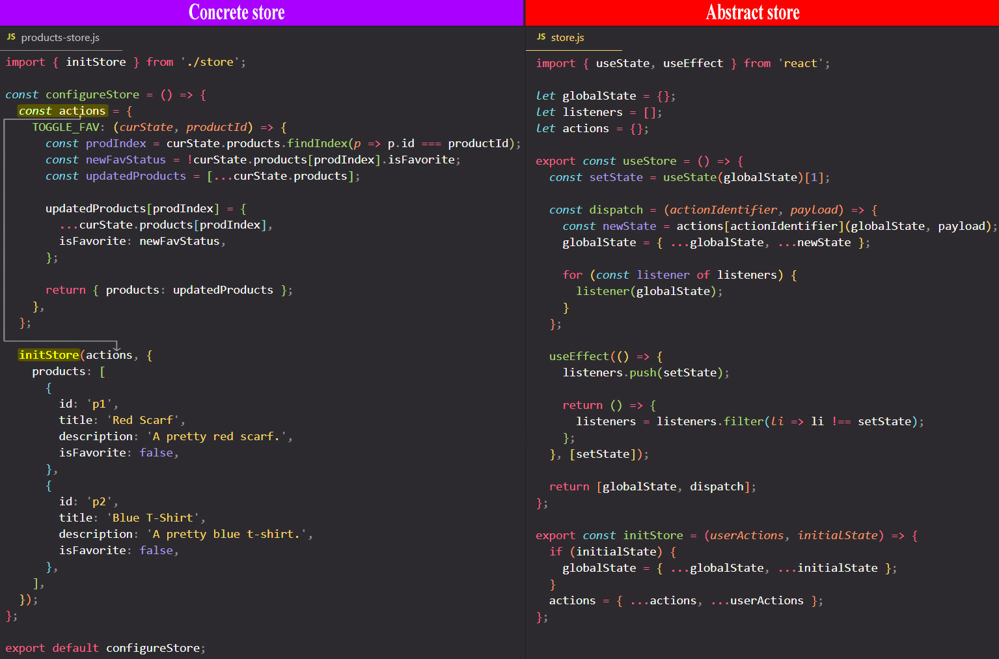
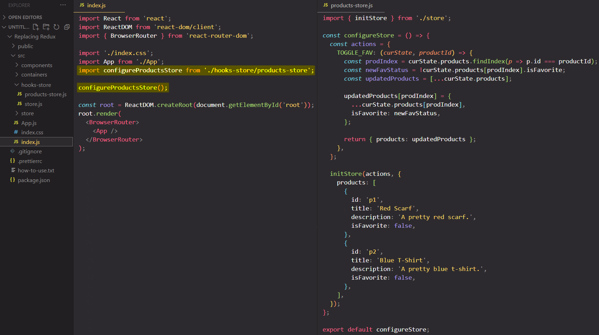
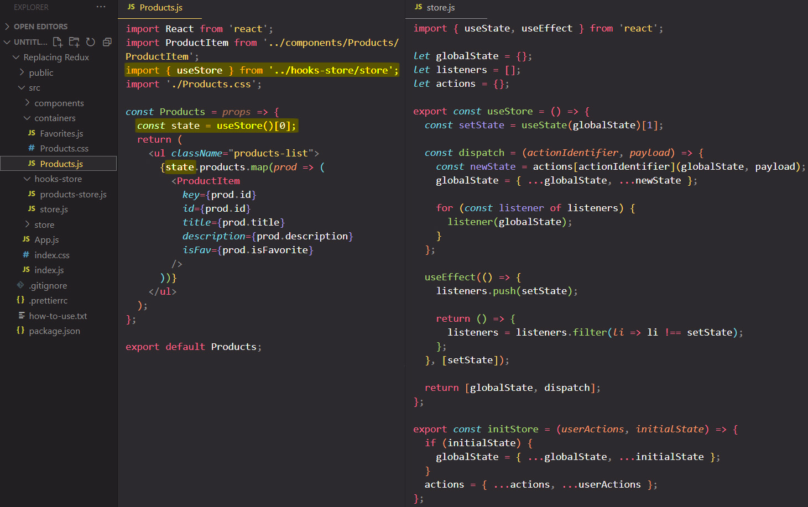
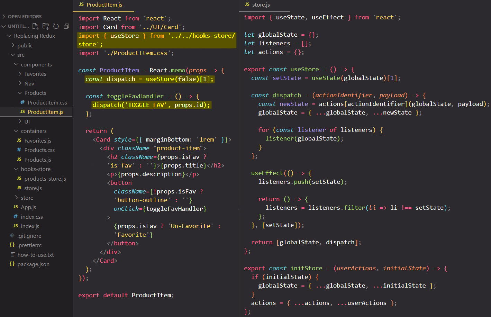
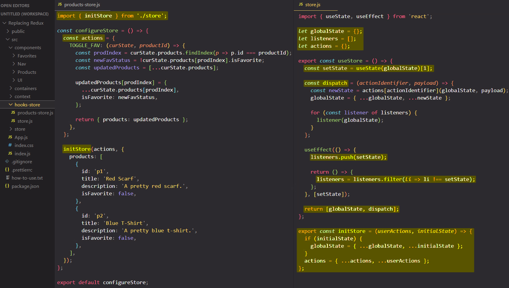

# Alternative 2: Using a custom Hook - creating a concrete store & using the custom store

So to use the concrete store defined in "products-store.js" file, we need to go to the "index.js" file, import the `configureStore` function from "products-store.js" file and call it to setup our store.

Now, the cool thing is we don't need to wrap `configureStore` in a provider component or anything like that. 

==By calling `configureStore` function we initialize our concrete store, and `configureStore` will call `initStore` function and `initStore` will initialize our global variables (`globalState`, `listeners` and `actions`) with the values we're passing to it.==

==If we had multiple stores, we would simply call `configureStore` for each different concrete store==, so you would call all the `configureStore` functions for all the different concrete stores you might have in your app, and with that the stores are ready to use.

Now, to use it, we can simply go to the component where we need it:

## Summary

So what we built here in the end is our custom Redux like store implementation.

We're having some variables (`globalState`, `listeners` and `actions`) which are not global (not registered on the `window` object) but which do exist in the "store.js" file and **these variables only exist _once_ in our application lifetime**, so **they're shared in the entire application**. Every file which imports from the "store.js" file will use the same values which are stored in `globalState`, `listeners` and `actions` variables.

Then in the same "store.js" file we create our own custom hook (`useStore`). The `globalState`, `listeners` and `actions` variables are defined outside of the `useStore` custom hook and that's an important thing because if they were defined inside of the `useStore` custom hook, then every component that used the `useStore` custom hook would use its own variables with its own values, but ==since these variables are defined outside of the `useStore` custom hook every component that uses the `useStore` custom hook uses the _same variables_ with the _same values_. **So now we're not just sharing the hook _logic_ but also shared the hook _data_**.== By sharing hook logic and state we can manage globally some state (`globalState`), some actions (`actions`) and listeners  (`listeners`). 

==In our `useStore` custom hook we're managing **`listeners` that are interested in _state changes_, which in turn are _triggered_ by `actions`**. We're having our `dispatch` function which makes sure that whenever we call it we update our `globalState` and we call our `listeners`, where our `listeners` are in the end just `setState` calls, so by doing this any component that uses the `useState` custom hook will re-render==.

We're register one listener per component with the help of `useEffect` and we unregister it when that component unmounts.

We then also have a way of ==initializing our store with the help of `initStore` function which you can _call multiple times_ because _we're not replacing our `globalState` or replacing our `actions`_, instead we're always taking the current `globalState` and the current `actions` to merge in them new data. We're doing this so that you can create concrete **store slices**==, just as we're doing it with Redux with multiple reducers, where is one slice you manage your products, maybe in another slice you manage the user authentication status.

Then from anywhere in our project we can use the `useStore` custom hook to either tap into our `globalState` or use the `dispatch` function to dispatch an action.

## References

1. [React - The Complete Guide (incl Hooks, React Router, Redux) - Maximilian Schwarzmüller](https://www.udemy.com/course/react-the-complete-guide-incl-redux/)