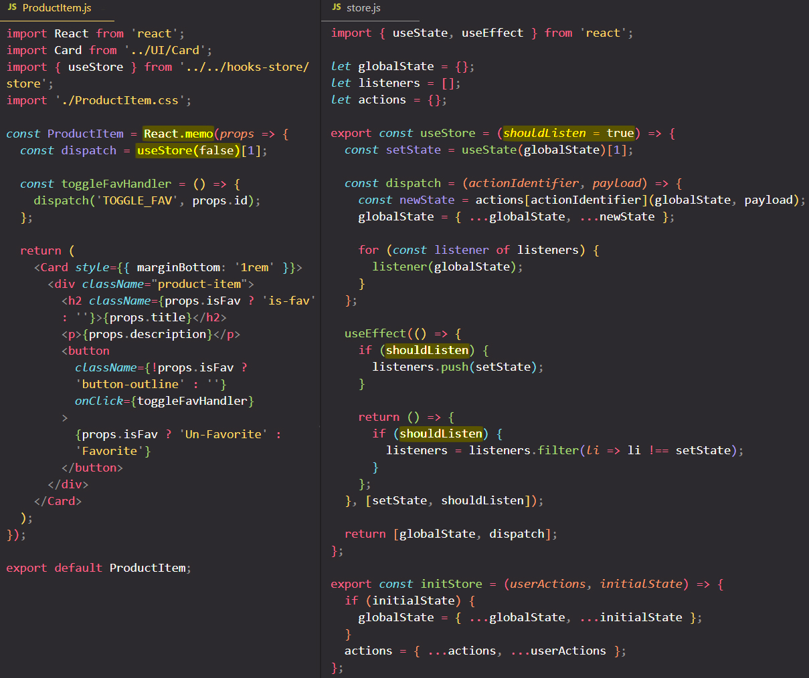

# Optimizing the custom store hook

In our `useStore` custom hook we could accept an argument (`shouldListen`) with a default value. ==We can use that argument (`shouldListen`) to _determine whether we actually want to register a listener (state updating function) for a component or not_==.

So for the `ProductItem` component which is using the `useStore` custom hook, ==because is a component which only _uses the `useStore` custom hook to **only dispatch actions**_, well then we don't want to listen to state changes inside of it==. Inside `ProductItem` component we're not interested in state changes, we're only using the `useStore` custom hook so that we can dispatch an action.

So the `ProductItem` component should not register a listener (state updating function) in the global `listeners` array, and therefore it shouldn't re-render when the `globalState` changes because in `ProductItem` component we're really not interested in state changes.

## References

1. [React - The Complete Guide (incl Hooks, React Router, Redux) - Maximilian Schwarzmüller](https://www.udemy.com/course/react-the-complete-guide-incl-redux/)