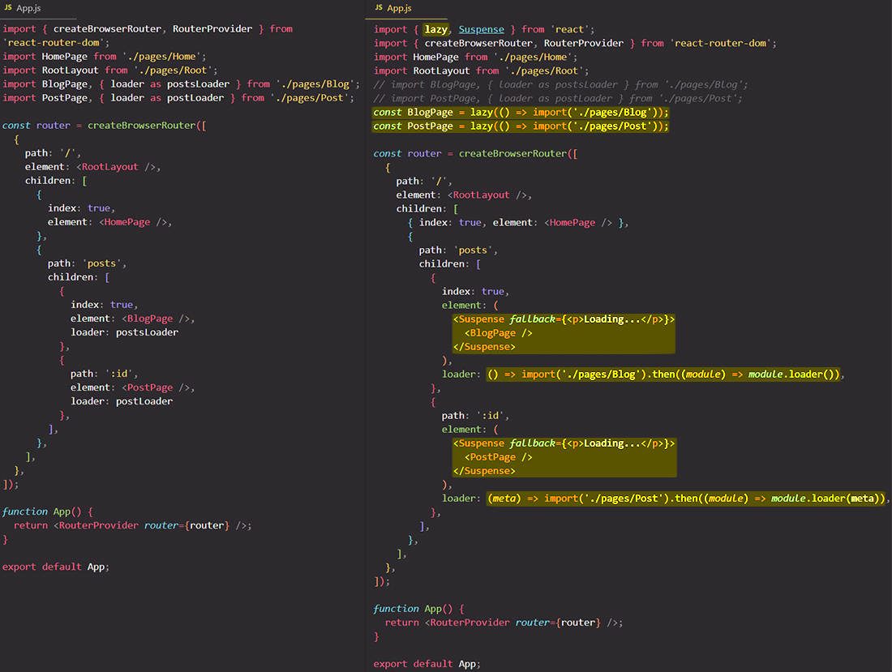

# Understanding & adding lazy loading

Lazy loading means that you wanna ==load certain pieces of code only when it's needed==. The idea behind lazy loading is that you tell to browser to load certain components only when they're needed, instead of ahead of time.

You can ==call `import` as a function== and in that case it will import something dynamically, only when it's needed. ==When you call `import` as a function it gives you a promise because is an asynchronous process==, which can take a bit longer because it must download the code after all.

## References

1. [React - The Complete Guide (incl Hooks, React Router, Redux) - Maximilian Schwarzmüller](https://www.udemy.com/course/react-the-complete-guide-incl-redux/)