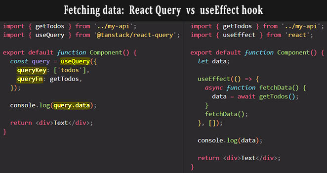

# Fetching data with `useQuery` hook

Instead of manually fetching data in a `useEffect` function like we used to do, we will now let React Query do the fetching work:



==A query is a declarative dependency on an asynchronous source of data that is tied to a **unique key**.== A query can be used with any Promise based method (including GET and POST methods) to fetch data from a server. If your method modifies data on the server, we recommend using [Mutations](https://tanstack.com/query/v4/docs/react/guides/mutations) instead.

## `useQuery` options

==We fetch data from the server with the help of `useQuery` hook.== To subscribe to a query in your components or custom hooks,  we need to pass to `useQuery` an object with at least two properties:

1. ==The `queryKey`: a **unique key for the query**== This unique key **uniquely identify the data** that we're going to query. The **unique key** you provide is used internally for re-fetching, caching, and sharing your queries throughout your application.

   The `queryKey` can hold as a value a complex array, or it can just be an array with a string, but ==it needs to be **an array**==.  The string that we pass to `queryKey` is what we will later also see in React Query DevTools cache. If later we would use `useQuery` on another page with the same key, then the data that correspond to that key would be read from the React Query cache.

   ```react
   import { useQuery } from '@tanstack/react-query'
   
   function Todos() {
     const query = useQuery({ queryKey: ['todos'] });
   }
   ```

2. ==The `queryFn` (query function)==. The `queryFn` need to be _a function that returns a Promise_ that resolves the data or throws an error. This is the function that the query will use to _request data from the API_.

   ```react
   import { getTodos } from '../my-api'
   import { useQuery } from '@tanstack/react-query'
   
   function Todos() {
     const query = useQuery({
       queryKey: ['todos'], 
       queryFn: getTodos, // this function always need to return a Promise
     });
   }
   ```

## `useQuery` returns an object

==The `useQuery` hook will **return an object** with a bunch of useful properties== that we can use in our app. The most important property is `data`.

The query result returned by `useQuery` contains all of the information about the query that you'll need for templating and any other usage of the data.

The `query` object contains a few very important states you'll need to be aware of to be productive. A query can only be in one of the following states at any given moment:

- `isLoading` or `status === 'loading'` - The query has no data yet
- `isError` or `status === 'error'` - The query encountered an error
- `isSuccess` or `status === 'success'` - The query was successful and data is available

Beyond those primary states, more information is available depending on the state of the query:

- `error` - If the query is in an `isError` state, the error is available via the `error` property.
- `data` - If the query is in an `isSuccess` state, the data is available via the `data` property.

```react
import TodosItem from './components/TodosItem';
import Spinner from './components/Spinner';
import { getTodos } from '../my-api';
import { useQuery } from '@tanstack/react-query';

function Todos() {
  const query = useQuery({
    queryKey: ['todos'],
    queryFn: getTodos, // this function always need to return a Promise
  });

  if (query.isLoading) return <Spinner />;

  return (
    <>
      <div>
        {query.data.map(item => (
          <TodosItem key={item.id} />
        ))}
      </div>
    </>
  );
}
```

==For **most** queries, it's usually sufficient to check for the `isLoading` state, then the `isError` state, then finally, assume that the data is available and render the successful state==.

## Query Keys (`queryKey`)

At its core, ==TanStack Query **manages query caching for you based on query keys (**`queryKey`**)**==. Query keys have to be an Array at the top level, and can be as simple as an Array with a single string, or as complex as an array of many strings and nested objects. As long as the query key is serializable, and ==**unique to the query's data**==, you can use it!

When a query needs more information to uniquely describe its data, you can use an array with a string and any number of serializable objects to describe it.

```react
// An individual todo
useQuery({ queryKey: ['todo', 5], ... })

// An individual todo in a "preview" format
useQuery({ queryKey: ['todo', 5, { preview: true }], ...})

// A list of todos that are "done"
useQuery({ queryKey: ['todos', { type: 'done' }], ... })
```

==If your query function depends on a variable, include it in your query key!== Since query keys uniquely describe the data they are fetching, they should ==include any variable you use in your query function that **change**==. For example:

```tsx
function Todos({ todoId }) {
  const result = useQuery({
    queryKey: ['todos', todoId],
    queryFn: () => fetchTodoById(todoId),
  })
}
```

Note that ==**query keys act as dependencies for your query functions**. Adding dependent variables to your query key will ensure that queries are cached independently, and that any time a variable changes, *queries will be refetched automatically* (depending on your `staleTime` settings).==

## Query Functions (`queryFn`)

A query function can be literally ==any function that **returns a Promise**==. The Promise that is returned should either ==**resolve the data** or **throw an error**==.

All of the following are valid query function configurations:

```tsx
useQuery({ queryKey: ['todos'], queryFn: fetchAllTodos })

useQuery({ queryKey: ['todos', todoId], queryFn: () => fetchTodoById(todoId) })

useQuery({
  queryKey: ['todos', todoId],
  queryFn: async () => {
    const data = await fetchTodoById(todoId)
    return data
  },
})

useQuery({
  queryKey: ['todos', todoId],
  queryFn: ({ queryKey }) => fetchTodoById(queryKey[1]),
})
```

#### Handling and throwing errors

==For TanStack Query to determine a query has errored, the query function **must throw** or return a **rejected Promise**.== Any error that is thrown in the query function will be persisted on the `error` state of the query.

> **IMPORTANT**: ==React Query does not invoke the `queryFn` on every re-render, even with the default `staleTime` of zero.== Your app can re-render for various reasons at any time, so fetching every time would be insane!
>
> If you see a refetch that you are not expecting, it is likely because you just focused the window and React Query is doing a `refetchOnWindowFocus`, which is a great feature for production: If the user goes to a different browser tab, and then comes back to your app, a background refetch will be triggered automatically, and data on the screen will be updated if something has changed on the server in the meantime. All of this happens without a loading spinner being shown, and your component will not re-render if the data is the same as you currently have in the cache.
>
> During development, this will probably be triggered more frequently, especially because focusing between the Browser DevTools and your app will also cause a fetch, so be aware of that.

## React Query Overview

```react
import {
  useQuery,
  useMutation,
  useQueryClient,
  QueryClient,
  QueryClientProvider,
} from '@tanstack/react-query'
import { getTodos, postTodo } from '../my-api'

// Create a client
const queryClient = new QueryClient()

function App() {
  return (
    // Provide the client to your App
    <QueryClientProvider client={queryClient}>
      <Todos />
    </QueryClientProvider>
  )
}

function Todos() {
  // Access the client
  const queryClient = useQueryClient()

  // Queries
  const query = useQuery({ queryKey: ['todos'], queryFn: getTodos })

  // Mutations
  const mutation = useMutation({
    mutationFn: postTodo,
    onSuccess: (data) => {
      // Invalidate and refetch
      queryClient.invalidateQueries({ queryKey: ['todos'] })
      console.log(data)
    },
    onError: (error) => {
      console.log(error)
    },
  })

  return (
    <div>
      <ul>
        {query.data?.map((todo) => (
          <li key={todo.id}>{todo.title}</li>
        ))}
      </ul>

      <button
        onClick={() => {
          mutation.mutate({
            id: Date.now(),
            title: 'Do Laundry',
          })
        }}
      >
        Add Todo
      </button>
    </div>
  )
}
```

## References

1. [The Ultimate React Course: React, Redux & More - Jonas Schmedtmann](https://www.udemy.com/course/the-ultimate-react-course/)
1. [Queries - tanstack.com](https://tanstack.com/query/latest/docs/react/guides/queries)
1. [`useQuery` - tanstack.com](https://tanstack.com/query/latest/docs/react/reference/useQuery)
1. [Query Keys - tanstack.com](https://tanstack.com/query/latest/docs/react/guides/query-keys)
1. [Query Functions - tanstack.com](https://tanstack.com/query/latest/docs/react/guides/query-functions)
1. [React Query defaults explained - tkdodo.eu](https://tkdodo.eu/blog/practical-react-query#the-defaults-explained)