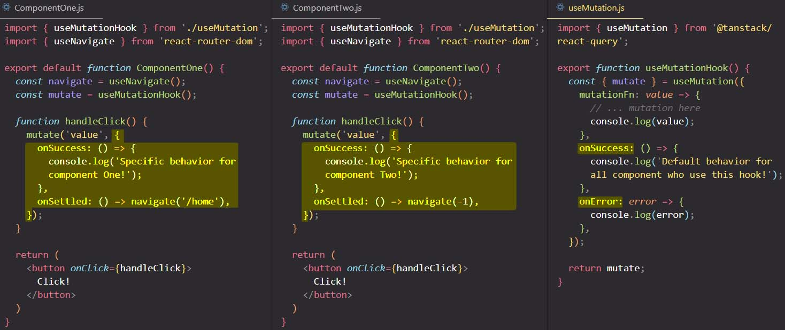

# Mutating data with `useMutation` hook

Up until now we learned how to fetch and store data in the cache, using the `useQuery` hook. Now it's time to learn how to also mutate our remote server data, and automatically re-render the user interface.

To mutate our remote server state we need to use the **`useMutation` hook**. To `useMutation` we need to pass in an object with one thing:

1. ==The `mutationFn` method.== This is the function that React Query will call to mutate our remote server data.

   ```react
   import { postTodo } from '../my-api'
   import { useMutation } from '@tanstack/react-query'
   
   function Todos() {
     const mutation = useMutation({ 
       mutationFn: postTodo, // A function that performs an asynchronous task and returns a Promise 
     });
   }
   ```

==The `useMutation` hook will **return an object** with a bunch of useful properties and methods== that we can use in our app to mutate data on the server. ==The most important method is **`.mutate()`**. This method can be connected to our event handlers, inside our React components.==

==The `.mutate()` method will call the function that we pass as value to the `mutationFn` key.==

## Automatically update the UI after mutate server's data: `onSucces` method & `queryClient.invalidateQuerie()` method

By defining only the `mutationFn` property, the UI will not be update automatically after we mutate the data on our server. If we want to trigger automatically UI updates after we mutate the data that's on our server, to `useMutation` we can pass another property that is optional, and is called `onSucces`. ==`onSucces` will hold a method that will **invalidating the cache as soon as the mutation is done**==, so with `onSucces` method we tell React Query what to do as soon as the mutation was successful.

==We **manually invalidating the cache** by using the **`queryClient.invalidateQueries()`** method. This method tells React Query to immediately re-fetch the data that's on our server==.

To `.invalidateQueries()` method we need to pass as argument the `queryKey` that we want to invalidate in our cache.

> **NOTE**: We define the `queryKey` in `useQuery()` hook.

How do we get access to our `queryClient` instance? Well, for that we have a special hook called **`useQueryClient`**. ==The `useQueryClient` hook returns the current `QueryClient` instance.==

```react
import { postTodo } from '../my-api'
import { useMutation,  useQueryClient } from '@tanstack/react-query'

function Todos() {
  // Access the client
  const queryClient = useQueryClient();
  
  const mutation = useMutation({
    mutationFn: postTodo,
    onSuccess: (data) => {
      // onSuccess function receive as parameter the data returned by mutationFn (postTodo)
      // Invalidate and re-fetch
      queryClient.invalidateQueries({ queryKey: ['todos'] }) // re-fetch the server data after mutation is done
    },
  });
}
```

> **NOTE**: The `onSucces` method will fire when the mutation is successful and will be _passed the mutation's result_. If a Promise is returned, it will be awaited and resolved before proceeding.

==You can invalidate queries by passing to `.invalidateQueries()` an object with this shape `{active: true}`. `invalidateQueries({ active: true })` will invalidate **all the queries that are currently active on the page**.==

```react
import { postTodo } from '../my-api'
import { useMutation,  useQueryClient } from '@tanstack/react-query'

function Todos() {
  const queryClient = useQueryClient();
  
  const mutation = useMutation({
    mutationFn: postTodo,
    onSuccess: (data) => {
      queryClient.invalidateQueries({ active: true }) // {active: true} will invalidate all the queries that are currently active on the page
    },
  });
}
```

`invalidateQueries({ active: true })` is a bit easier, because then we don't have to remember any query keys.

## The `onError` property _(optional)_

Another optional property that we can define in the object passed to `useMutation()` is the `onError` property. ==The `onError` property will hold a function that will fire if the mutation encounters an error and will be passed the error.== If a Promise is returned, it will be awaited and resolved before proceeding.

```react
import { postTodo } from '../my-api'
import { useMutation, useQueryClient } from '@tanstack/react-query'

function Todos() {
  // Access the client
  const queryClient = useQueryClient();
  
  const mutation = useMutation({
    mutationFn: postTodo,
    onSuccess: (data) => {
      // Invalidate and re-fetch
      queryClient.invalidateQueries({ queryKey: ['todos'] }) // invalidate the cache data that correspond to 'todos' query and re-fetch it after the mutation is done
    },
    onError: (error) => {
      alert(error.message);
    },
  });
}
```

## The `mutationFn` receives only a single parameter

The `mutationFn` receives only a single parameter, so if you want to pass to `mutationFn` multiple values, you need to wrap them into an object:

```react
import { postTodo } from '../my-api'
import { useMutation, useQueryClient } from '@tanstack/react-query'

function Todos() {
  const queryClient = useQueryClient();
  
  const mutation = useMutation({
    mutationFn: ({ keyOne: 'value1', keyTwo: 'value2' }) => postTodo(keyOne, keyTwo),
  });
}
```

## Mutation function options. Specify individual behavior for each mutate function

We can also add, for example, `onSuccess` or `onError` handlers, not only into the `useMutation` hook, but right into the individual mutate function. So again, we do not need to specify these handlers for _all of the mutations_ by passing them directly into the `useMutation` hook, but we can also do it for _individual mutations_.

You specify the individual mutate function behavior by passing to the mutate function an object. This object will contains indiviaul mutation options.

So in the `<ComponentOne>` and `<ComponentTwo>` `onSuccess` will different behavior (specific to each component), different from the behavior specified in the `useMutation` hook.



We can say that in `useMutation` hook we specify the default behavior for functions like `onSuccess`, `onError`, `onSettled` etc, but we can overwrite these behavior in each individual mutate functions.

## React Query Overview

```react
import {
  useQuery,
  useMutation,
  useQueryClient,
  QueryClient,
  QueryClientProvider,
} from '@tanstack/react-query'
import { getTodos, postTodo } from '../my-api'

// Create a client
const queryClient = new QueryClient()

function App() {
  return (
    // Provide the client to your App
    <QueryClientProvider client={queryClient}>
      <Todos />
    </QueryClientProvider>
  )
}

function Todos() {
  // Access the client
  const queryClient = useQueryClient()

  // Queries
  const query = useQuery({ queryKey: ['todos'], queryFn: getTodos })

  // Mutations
  const mutation = useMutation({
    mutationFn: postTodo,
    onSuccess: (data) => {
      // Invalidate and refetch
      queryClient.invalidateQueries({ queryKey: ['todos'] })
    },
  })

  return (
    <div>
      <ul>
        {query.data?.map((todo) => (
          <li key={todo.id}>{todo.title}</li>
        ))}
      </ul>

      <button
        onClick={() => {
          mutation.mutate({
            id: Date.now(),
            title: 'Do Laundry',
          })
        }}
      >
        Add Todo
      </button>
    </div>
  )
}
```

## References

1. [The Ultimate React Course: React, Redux & More - Jonas Schmedtmann](https://www.udemy.com/course/the-ultimate-react-course/)
2. [`useMutation` - tanstack.com](https://tanstack.com/query/latest/docs/react/reference/useMutation)
3. [`useQueryClient` - tanstack.com](https://tanstack.com/query/latest/docs/react/reference/useQueryClient)