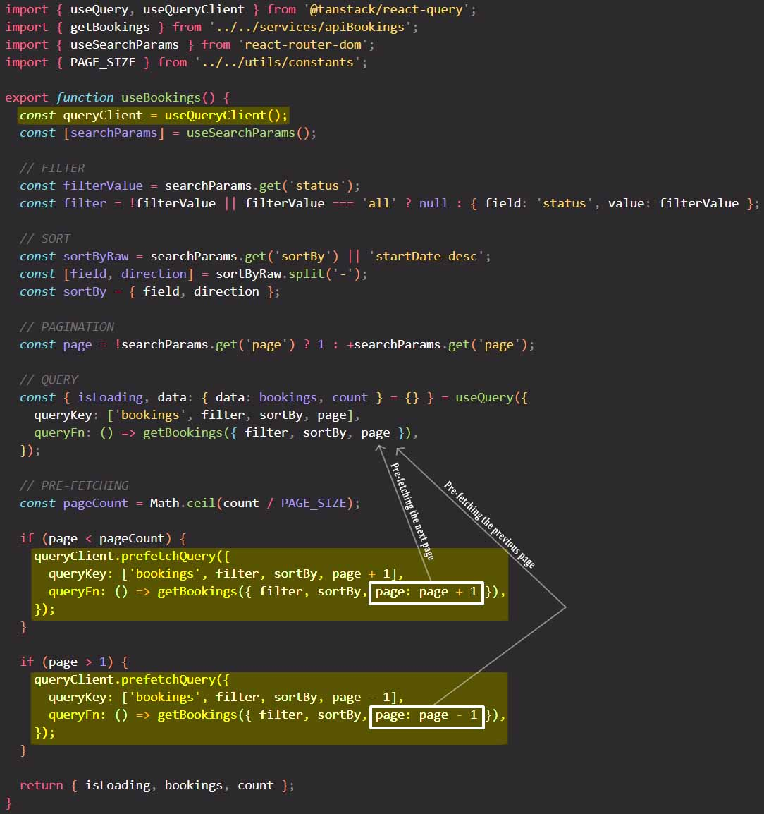

# Pre-fetching data with `prefetchQuery` method

==Pre-fetching is all about fetching some data that we know might become necessary before we actually need that data to render it on the UI.== An example is when we implement a pagination: in the context of pagination, pre-fetching means that we fetch the next page before it is actually displayed on the UI.

The way pre-fetching works is that we first need get `const queryClient = useQueryClient()`, and then on `queryClient` we call the `.prefetchQuery()` method.

The way `queryClient.prefetchQuery()` works is basically exactly the same as the `useQuery` hook itself, so we need a `queryKey` and a `queryFn` inside an object.

An alternative pre-fetching is to use infinite queries for infinite scroll with React Query. So React Query also has that feature built-in, so if you want, you can check out the documentation and read all about that.

## References

1. [The Ultimate React Course: React, Redux & More - Jonas Schmedtmann](https://www.udemy.com/course/the-ultimate-react-course/)