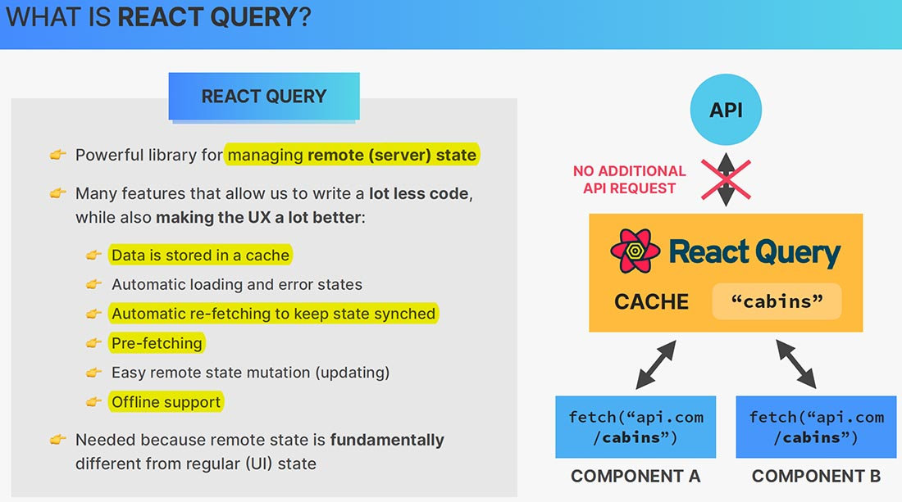

# What is React Query?

TanStack Query (FKA React Query) is often described as the missing ==data-fetching library for web applications==, but in more technical terms, ==it makes **fetching, caching, synchronizing and updating server state** in your web applications== a breeze.

==While most traditional state management libraries are great for working with client state, they are **not so great at working with async or server state**. This is because **server state is totally different**.== For starters, server state:

- Is persisted remotely in a location you do not control or own
- Requires asynchronous APIs for fetching and updating
- Implies shared ownership and can be changed by other people without your knowledge
- Can potentially become "out of date" in your applications if you're not careful

Once you grasp the nature of server state in your application, **even more challenges will arise** as you go, for example:

- Caching... (possibly the hardest thing to do in programming)
- Deduping multiple requests for the same data into a single request
- Updating "out of date" data in the background
- Knowing when data is "out of date"
- Reflecting updates to data as quickly as possible
- Performance optimizations like pagination and lazy loading data
- Managing memory and garbage collection of server state
- Memoizing query results with structural sharing

==React Query is hands down one of the best libraries for managing server state. It works amazingly well **out-of-the-box, with zero-config, and can be customized** to your liking as your application grows.==

On a more technical note, React Query will likely:

- Help you remove **many** lines of complicated and misunderstood code from your application and replace with just a handful of lines of React Query logic.
- Make your application more maintainable and easier to build new features without worrying about wiring up new server state data sources
- Have a direct impact on your end-users by making your application feel faster and more responsive than ever before.
- Potentially help you save on bandwidth and increase memory performance

## Data is stored in a cache

The most fundamental thing about React Query is that ==**all remote state is cached**, which means that the fetched data will be stored in order to be reused in different points of the application.==

For example, if we fetch data about cabins in Component A, React Query will fetch the data from the API. It will then store the received data in the cache, so that Component A can use it. Then if at a later point, Component B also wants to fetch the cabin data, then no additional API request will be necessary. Instead, React Query will simply provide the same data to Component B from the cache.

## Automatic re-fetching to keep state synched

React Query also ==automatically re-fetches the data in certain situations==. For example, after a certain timeout or after we leave the browser window and then come back to it.

This is super important in order to make sure that ==a remote state always stays in sync with the application==. For example, if some other user of the app changes the remote state at some point, for example, by updating a cabin, then the application running on all other computers will have this cabin state out of sync with the newly updated state. And so, React Query can help with this as well by keeping everything in sync with  automatically re-fetching data.

## Pre-fetching

Besides re-fetching, we can also pre-fetch data, which basically means to ==fetch data that we know will become necessary later, but before it is actually displayed on the screen==. A classic example of this is pagination, where with pre-fetching, we can fetch data not only for the current page, but also for the next page.

This way, when the user then moves to the next page, the data will always already be there in the cache.

## Offline support

A feature that I find really useful is ==support for when the user becomes offline==. So, in this situation, since the data is already cached, as the user moves around in the app while being offline, Components A and B can still be displayed using this cached cabin data.

## Why do we need React Query?

We need a library like React Query with all these features because ==**remote state** is fundamentally different from **UI state**. Remote state is asynchronous and usually shared by many users of the app, which makes it so that applications running in different browsers can very easily get out of sync with the remote data that is stored on a server==.

Remote state has many special needs, and so that's the reason why we use something like React Query.

Now, there are actually other libraries that do many of the things that React Query does. For example, SWR or Redux Toolkit Query, which as the name says, is the remote state solution integrated into Redux Toolkit. However, from what I've seen, none of them works as well and is as popular as React Query.

## References

1. [The Ultimate React Course: React, Redux & More - Jonas Schmedtmann](https://www.udemy.com/course/the-ultimate-react-course/)