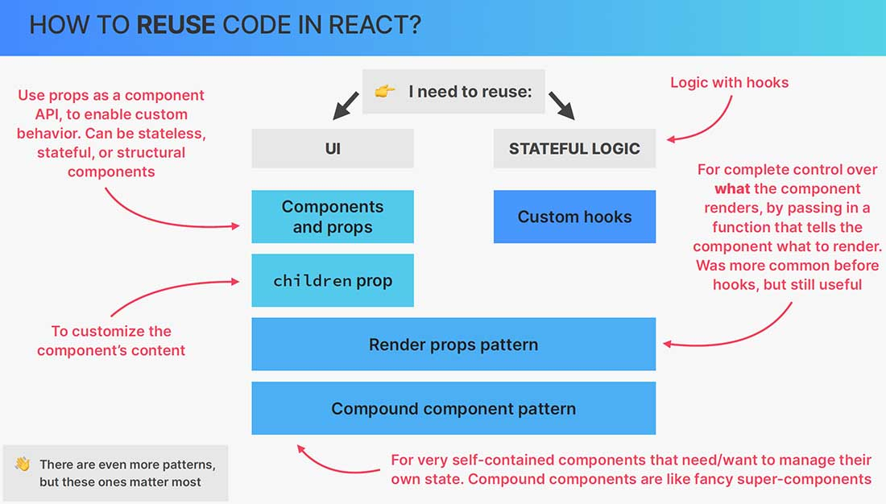

# How to **reuse** code in React?

This section is all about advanced React patterns that are used by senior React engineers to _make components even more reusable and flexible_. So since this part is about reusability, and since we already talked a lot about reusability before, let's now get a quick overview of how we can reuse different types of code in React, and how these advanced patterns that we're gonna talk about fit into the picture.

==In React, we basically might want to **reuse two big types of code**:==

1. we can ==reuse pieces of **UI**==;
2. we can ==reuse some **stateful logic**==, so logic that contains at least one React hook, no matter which one.

## Reuse pieces of UI

Now, there's also a third category, which is simply for **reusing some non-stateful logic**, but for that, we can simply use normal JavaScript functions, but ==for React, what matters is how we **reuse _UI_ and _stateful logic_**==.

As we already know, ==to reuse pieces of the UI, we use **components and props**==. The idea is that we use props basically as an API for the component, so as a way of interacting with the component from the outside so that we can customize how it works and what it looks like.

Now, taking this idea one step further, we can even ==pass in content or other components into components, simply by using the slightly more advanced, but extremely useful **`children` prop**. So basically, in order to customize not only what a component looks like, but also the content itself.==

## Reuse stateful logic

Now, moving on to reusing stateful logic, we already know that we can do so simply by writing our own ==**custom hooks**==. Custom hooks allow us to write our own React hooks, which are composed of any number of any other hooks.

## Advanced patterns

But what if we need to ==reuse visuals and stateful logic at the same time== in some more advanced ways? Well, that's where more advanced patterns come into play.

#### Render props pattern

One of these advanced patterns that developers came up with is the so-called render props pattern. And _I say pattern because these are not things that are baked into React, so they are not React features_. Instead, they are simply clever ways of using React that have emerged over time in order to solve certain problems. But anyway, ==with render props, the user of a component has complete control over what the component actually renders by **passing in a function as a prop**==.

==This function basically tells the component what and how to render.== And _the beauty of this is that with this pattern, we can reuse logic that has some UI, so some JSX attached to it, while giving the component the ability to receive even more JSX._ This sounds a bit like the same thing as the `children` prop, but this is quite different actually.

This pattern was actually super common in the old days before React hooks, because it was basically the only way of sharing stateful logic across different components. But today for that, we already have custom hooks, and so now, this pattern isn't as common as it was before. However, it's still very useful and very important for certain situations in which we really do want to reuse some logic that has some UI attached to it.

#### Compound component pattern

Now for the second advanced pattern that we will talk about, we have the compound component pattern. And compound means, in this context, that ==we will have **multiple components that play together in order to create one big, let's call it super component**, which is then the compound component==.

This pattern allows us to ==build extremely **self-contained components** that need to, or that want to manage their own state internally, so without that state being necessary inside the parent component that uses the compound component==.

## Build React components with reusability in mind

Remember, the key to component reusability is creating components that are focused, modular, and decoupled from specific contexts. By following these patterns and leveraging React's features, you can build reusable components that promote code reuse and maintainability.

When designing components with reusability in mind, it's essential to focus on creating components that have a clear responsibility, are loosely coupled, and expose a well-defined API through props. This allows them to be easily used and customized in various contexts, enhancing code reuse and maintainability in React applications.

## Overview

Reusability is an important concept in React, as it allows developers to ==write components that can be used across different parts of an application or even in different projects==. Reusability in React can be achieved through various techniques and patterns, some of which include:

- Presentational and container components
- Component Composition
- React Hooks
- Render Props
- Higher-Order Components (HOCs)
- Compound component
- Component Libraries

Now, there are even more patterns than these two, but if you know how to use, and when to use these two, that will already set you apart from most of the other React developers out there.

## References

1. [The Ultimate React Course: React, Redux & More - Jonas Schmedtmann](https://www.udemy.com/course/the-ultimate-react-course/)