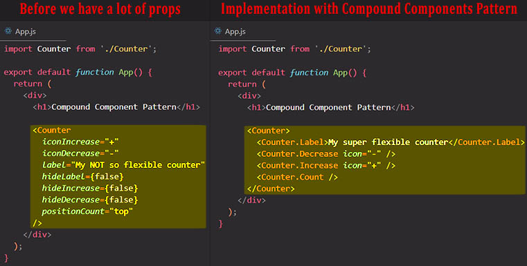
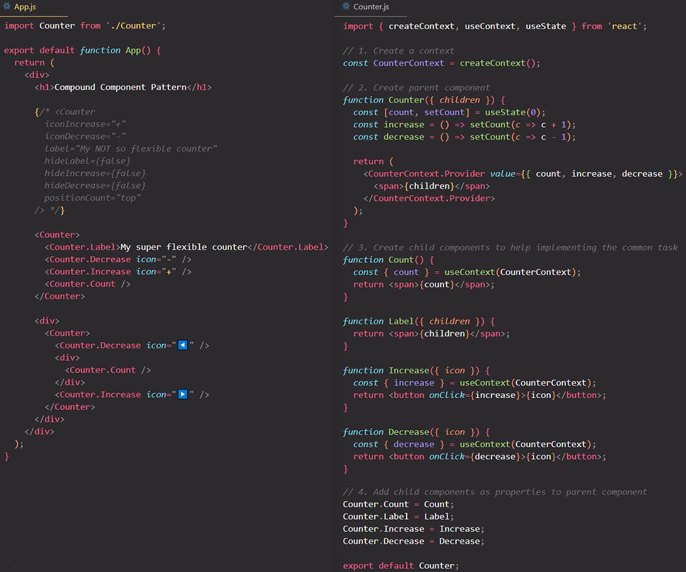
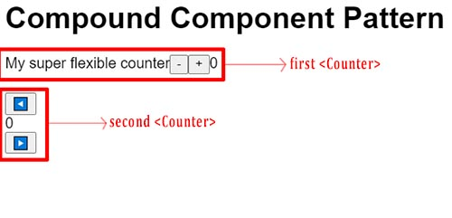
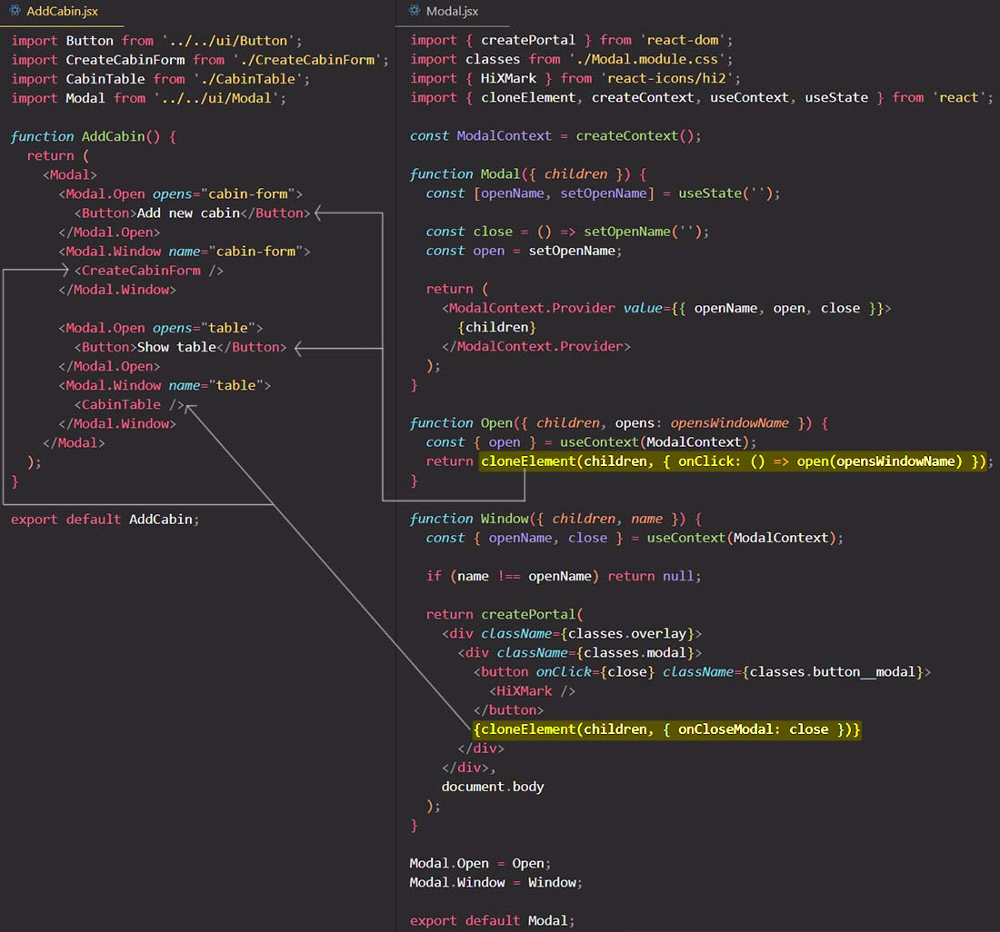

# The Compound Component pattern

The idea of a Compound Component is that we can ==create a **set of related components** that **together achieve a common and useful task**==, for example, implementing a counter. The Compound Component pattern can also be used in all kinds of components that are actually more useful, for example modal windows, pagination, tables, and so on.

==The alternative to Compound Component would be to create _a component with tons of props_ to exactly configure the component as we wanted, so that would then create a so-called **props explosion**.==

==The way we implement the Compound Component pattern is that we create a parent component, and then a few different child components that really belong to the parent, and that really only make sense when used together with the parent component.== A good example of this is the HTML `<select>` and `<option>` elements. The `<select>` element implements a select box, and the `<option>` element implements each of the select options inside the select box. These `<option>` elements can really only be used inside a `<select>` element, so they only make sense within `<select>` element.

==The parent component will keep all the state and state updating logic, and it will pass to its children components via Context API.==

## Another example

 

## References

1. [The Ultimate React Course: React, Redux & More - Jonas Schmedtmann](https://www.udemy.com/course/the-ultimate-react-course/)