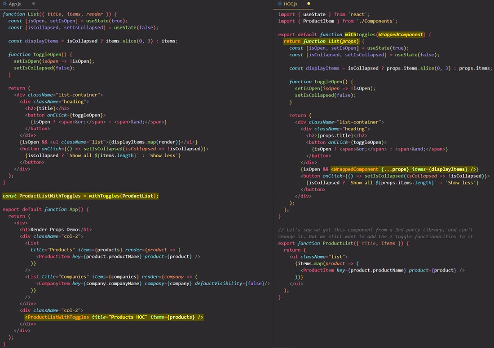
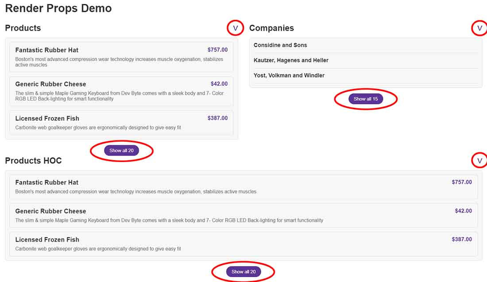

# The Higher-Order Components (HOC) pattern

The Higher-Order Component pattern is even less used than Render Prop Pattern, but it still very important for you to know about it. Basically we want to do something similar to what we did with the Render Props pattern, but with the Higher Order Component pattern.

Now, I would actually say that almost no one still writes Higher Order Components by hand, but I'm still gonna show you this because some libraries, do actually expose Higher Order Components, and then it's gonna be very useful to know what they are. So you don't need to know how to write them and in this lecture, I will just quickly show you a Higher Order Component, what it is, and how it works, and also why it would be used.

```react
function ProductList({ title, items }) {
  return (
    <ul className="list">
      {items.map((product) => (
        <ProductItem key={product.productName} product={product} />
      ))}
    </ul>
  );
}
```

Let's say we got the `<ProductList>` component from a 3rd-party library, and can't change it, but we still want to add the two toggle functionalities from `<List>` component (the component used in Render Props Pattern lecture) to it. So how could we do that?

One way would be to ==write a Higher Order Component to basically enhance or improve the `<ProductList>` component. A Higher Order Component is simply a component that **takes in another component** and then **returns a new component** that is better, so an enhanced version of the initial component.==

I actually already created the Higher Order Component called `withToggles` and let's take a look at it:

```react
import { useState } from "react";

export default function withToggles(WrappedComponent) {
  return function List(props) {
    const [isOpen, setIsOpen] = useState(true);
    const [isCollapsed, setIsCollapsed] = useState(false);

    const displayItems = isCollapsed ? props.items.slice(0, 3) : props.items;

    function toggleOpen() {
      setIsOpen((isOpen) => !isOpen);
      setIsCollapsed(false);
    }

    return (
      <div className="list-container">
        <div className="heading">
          <h2>{props.title}</h2>
          <button onClick={toggleOpen}>
            {isOpen ? <span>&or;</span> : <span>&and;</span>}
          </button>
        </div>
        {isOpen && <WrappedComponent {...props} items={displayItems} />}

        <button onClick={() => setIsCollapsed((isCollapsed) => !isCollapsed)}>
          {isCollapsed ? `Show all ${props.items.length}` : "Show less"}
        </button>
      </div>
    );
  };
}
```

==`withToggles` will basically add back the two toggles from the `<List>` component. It's pretty common that a Higher Order Component is called something that starts with `with` keyword, so that's kind of a convention,== because basically it will add the toggles to the component that we pass in with the help of `WrappedComponent` argument. So then we have a new component with toggles.

==The way in which we write a Higher Order Component is not that important. What matters is that it's usually called something that starts with `with` keyword,  and that it **takes in one component** and **returns a new one**, and the new one adds some functionality to that passing component.==

```react
const ProductListWithToggles = withToggles(ProductList); // we store the new component created by withToggles() in ProductListWithToggles
```



With the Higher-Order Component pattern we reached our goal of enhancing the `<ProductList>` component with the features that we wanted it to have from `<List>` component. So if in any case you ever use a library which exports or which provides you with a Higher Order Component like this, then this is the logic behind that. So you called a Higher Order Component with another component as argument, and it will then return you an enhanced component.

All three components ==inherit the stateful logic & UI interface== from the `<List>` component:

- the first two are build with the React Props Pattern;
- the last is build with HOC Pattern.



## References

1. [The Ultimate React Course: React, Redux & More - Jonas Schmedtmann](https://www.udemy.com/course/the-ultimate-react-course/)