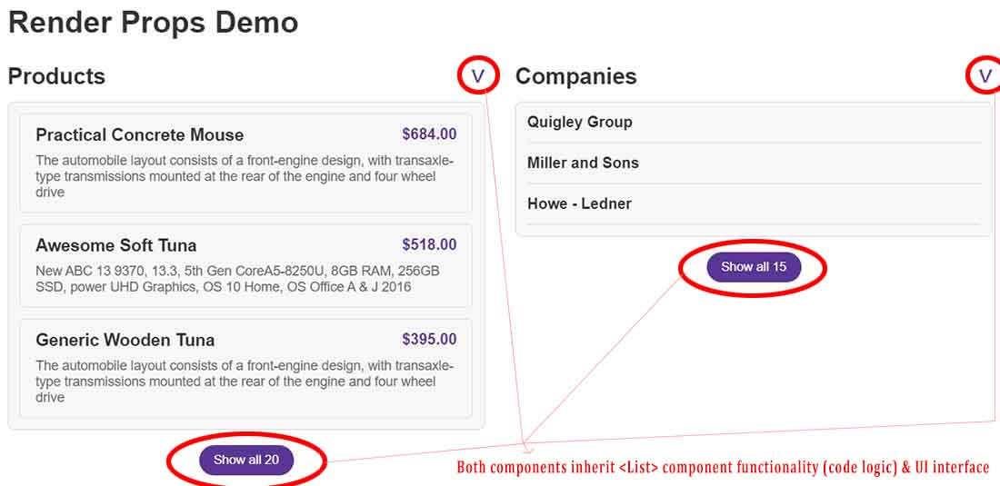

# The Render Props pattern

The Render Prop pattern is a technique used in React to ==**share code between components using a prop whose value is a function**. This pattern allows you to pass a function as a prop to a component, which that component can then invoke to render some part of its content.== This approach is particularly useful for creating flexible and reusable components.

The key advantage of the Render Prop pattern is that it allows you to ==**separate the rendering logic from the component itself**, making your components more versatile and reusable. Consumers of your component can decide what content to render by passing their own rendering logic as a function.== This pattern is commonly used for things like rendering lists, modals, tooltips, and other components where the structure of the content can vary based on usage.

==In addition to using a function as a prop, you can also pass additional data or props to the function, making it even more flexible and powerful.==

## Why we need the Render Props pattern?

Lets say we want to reuse the `<List>` component to rendering the `<ProductItem>`, but also for rendering the `<CompanyItem>`.   All that we want to be different between them is the highlighted code between `<ul>{}</ul>` closing tags.

The thing is that in the `<List>` component we have a bunch of stateful logic, which of course we can share using custom hooks. ==But we don't just want to use only `<List>` component stateful logic, we also want to use `<List>` component interface (JSX markup). We want to **use both the _state logic_ and the _UI interface_** that `<List>` component give us,== for `<ProductItem>` and `<CompanyItem>`.

**The problem is that `<List>` component display sometimes all items, but sometimes only the first three**. The `children` prop help us only if we wanted to just display all the items. The `children` prop is really not an option because it is quite limited in the fact that it only allows us to really pass in some content. But here, what we need is not to only pass the content in, but also pass in the instructions on how the items should be rendered.

How we can implement the `<List>` logic and UI by display sometimes all items, but sometimes only the first three, because `<ProductItem>` and `<CompanyItem>` are two different components? That's where the Render Props Pattern comes into play.

## The Render Prop pattern

==The Render Prop Pattern is all about **passing in a prop called `render`**, which is **a function that a component uses to know _what it should render_ and _how to do it_.**== Whenever you can't directly pass in JSX markup with the `children` prop, because you need to give the component a description on how to render som ething, then you need to reach for this Render Prop pattern.

To the `<List>` component we will ==pass in a prop called `render`, which need to be a function. This function will be the instructions of how to render something inside `<List>` component.==

This is what we call **inversion of control** and it's an important principle in software development in general.

Now, the `<List>` component no longer knows actually what it is rendering. It has no idea what will happen inside the `map()` function for each of the display items. All that it knows is that it received a `render` prop that contains a function, and `map()` will call the `render` prop function for each items in the array.

With Render Prop Pattern we achieved our goal of ==reusing all of `<List>` stateful logic and also the UI itself==.

> **NOTE**: The Render Prop Pattern used to be really the main way of sharing stateful logic across multiple components. So that was before we had React hooks, but now that we do have them, the Render Prop is not that used anymore, except for situations like this one and also a few other even more complex situations. So that's why I'm not gonna go really deep into the details and also really compare all the different patterns. Again, because custom hooks are now usually the way to go when we want to share logic.

## References

1. [The Ultimate React Course: React, Redux & More - Jonas Schmedtmann](https://www.udemy.com/course/the-ultimate-react-course/)